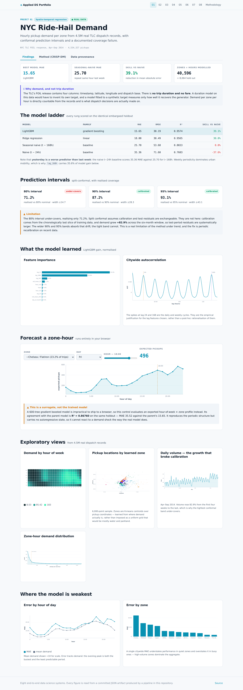
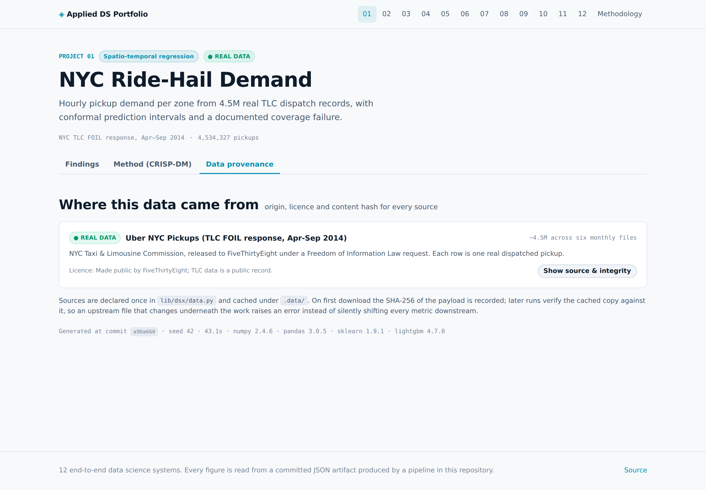

# 01 · NYC Ride-Hail Demand Forecasting

Hourly pickup demand per zone, learned from **4,534,327 real dispatched trips**
released by the NYC Taxi & Limousine Commission under a Freedom of Information Law request.

| Dataset | Kind | Size | Origin | Licence |
|---|:---:|---|---|---|
| [Uber NYC Pickups (TLC FOIL response, Apr-Sep 2014)](https://raw.githubusercontent.com/fivethirtyeight/uber-tlc-foil-response/master/uber-trip-data/uber-raw-data-{month}14.csv) | 🟢 **REAL** | ~4.5M across six monthly files | NYC Taxi & Limousine Commission, released to FiveThirtyEight under a Freedom of Information Law request. Each row is one real dispatched pickup. | Made public by FiveThirtyEight; TLC data is a public record. |

## The target, and why it is not trip duration

The FOIL release has four columns: `Date/Time`, `Lat`, `Lon`, `Base`. There is **no trip
duration and no fare**.

The reference portfolio this work responds to builds a "trip duration predictor" on this
dataset. It cannot: the column does not exist, so the target has to be synthesised. A model
fitted to a synthetic target measures only how well it recovers the generator that produced
it, which is a fact about the generator rather than about New York.

So the target here is the one the data actually supports — **pickup count per zone per
hour**. It is directly countable from the records, and it is the quantity dispatch decisions
are made on.

## Results

Embargoed chronological holdout: last 28 days,
40,596 training zone-hours, 8,064 test.

| Model | Family | MAE | RMSE | R² | Skill vs naive |
|---|---|---:|---:|---:|---:|
| LightGBM | gradient boosting | 15.65 | 30.19 | 0.957 | +39.1% |
| Ridge regression | linear | 18.00 | 30.49 | 0.957 | +30.0% |
| Seasonal naive (t − 168h) | baseline | 25.70 | 53.68 | 0.865 | +0.0% |
| Naive (t − 24h) | baseline | 35.36 | 71.60 | 0.760 | -37.6% |

**LightGBM reduces mean absolute error by 39.1%**
against repeating the same hour one week earlier.

Two things in that table are worth more than the winning number:

- **Yesterday is a *worse* predictor than last week.** The t−24h baseline scores
  35.36 MAE against 25.70 for t−168h — a
  -37.6% skill score. Weekly periodicity dominates
  urban mobility, which is why `lag_168h` carries 35.6% of model
  gain while `lag_24h` carries only 4.2%.
- **R² is nearly useless here.** Ridge and LightGBM both score 0.957, yet their
  MAE differs by 2.35. Anything that tracks the daily cycle
  scores high R²; only the error metric separates the models.

### Feature importance

| Feature | Share of gain |
|---|---:|
| `lag_1h` | 53.3% |
| `lag_168h` | 35.6% |
| `lag_24h` | 4.2% |
| `roll_mean_3h` | 2.3% |
| `hour_cos` | 0.7% |

## Prediction intervals — including one that failed

| Level | Nominal | Realised | Gap | Half-width | Verdict |
|---|---:|---:|---:|---:|---|
| 80% | 80% | **71.2%** | -0.0878 | ±14.7 | ❌ under-covers |
| 90% | 90% | **87.2%** | -0.0281 | ±28.3 | ✅ calibrated |
| 95% | 95% | **93.1%** | -0.0191 | ±43.1 | ✅ calibrated |

The 80% interval **under-covers**. This is reported rather than dropped,
and the cause is identifiable: split conformal assumes calibration and test residuals are
exchangeable, and they are not. Calibration comes from the chronologically last slice of
training data, while daily volume grew **+82.9%** from the first four weeks of the window to
the last. Test-period residuals are therefore systematically larger than calibration-period
residuals. The wider bands absorb that drift; the tightest one cannot. The fix is periodic
recalibration on recent data, not a different quantile.

## Two judgement calls on real data

**82,581 exact duplicate rows were kept, not dropped.**
Timestamps are minute-resolution and coordinates rounded to ~11 m, so distinct simultaneous dispatches from one base on one block are indistinguishable in this schema. Duplicate share rises with demand (peak hours highest), which is the signature of collision under coarse resolution rather than of a data fault. Dropping them would understate demand precisely at peak, so they are retained.

**24,505 rows outside a Manhattan-centred bounding box were
filtered.** Coordinates in this file reach from Philadelphia to eastern Long Island. Those
are real dispatches from other markets; clustering across that span would merge locations
100 km apart into a single "zone".

## Leakage controls

- Lags use groupby(zone).shift(k): a row can only see its own zone's past.
- Rolling windows are shift(1) before .rolling(), so the window ends at t-1 and an hour never enters its own rolling statistic.
- The panel is reindexed onto a complete hourly grid before lagging, so a missing hour cannot let lag_24h silently reach 25 hours back.
- 2,016 warm-up rows with incomplete lag history are dropped rather than imputed — imputing them would fabricate history.

## Zones

12 zones were learned by K-means over pickup coordinates rather than imposed as a
uniform grid — a uniform grid over this bounding box is mostly water and parkland.

| Zone | Trips | Share |
|---|---:|---:|
| ~Chelsea / Flatiron | 1,048,068 | 23.2% |
| ~Midtown | 842,609 | 18.7% |
| ~Financial District | 786,711 | 17.4% |
| ~Upper East Side | 645,909 | 14.3% |
| ~Williamsburg | 295,865 | 6.6% |
| ~Downtown Brooklyn | 263,617 | 5.8% |

## Serving

Two paths. A full LightGBM model for local use, and an exported hour-of-week × zone
surrogate so the published site can score interactively with no backend. The surrogate's
agreement with the parent model is **R² = 0.8676**
(MAE 35.52 against the parent's
15.65), published in the UI itself so the demo
reads as a documented approximation rather than as the trained model.

## Screens






## CRISP-DM record

> **Business question.** For each NYC zone, how many ride-hail pickups should be expected in the next hour, and how confident can a dispatcher be in that number?

### Business Understanding

Positioning idle vehicles ahead of demand is the core operational lever in ride-hail. Under-supply in a zone loses the fare and pushes riders to a competitor; over-supply pays drivers to idle. Both costs are asymmetric and both are paid hourly, so the useful forecast horizon is one hour at zone granularity.

**What is the prediction target?**

- **Chose:** Pickup count per zone per hour.
- **Why:** The FOIL extract records timestamp, coordinates and dispatch base only. It contains no trip duration and no fare. Demand is the quantity this data can actually support, it is directly countable from the records, and it is what dispatch decisions are made on.
- *Rejected:* Trip duration — the reference implementation this portfolio responds to predicts duration on this dataset, but the column does not exist; doing so requires synthesising the target, and a model fitted to a synthetic target measures only how well it recovers the generator.
- *Rejected:* Fare — likewise absent from the source.

**What accuracy would make this worth deploying?**

- **Chose:** Beat seasonal-naive MAE by a clear margin at zone-hour level.
- **Why:** Dispatchers already reason with 'same time last week'. A model is only worth operating if it improves on the heuristic the organisation would use for free.

### Data Understanding

4,534,327 real dispatched pickups spanning 2014-04-01 to 2014-09-30 across 5 dispatch bases. No nulls. Two quirks drive the preparation decisions: 1.8% exact duplicates and 0.1% of points lying outside the NYC market entirely.

**Should the 82,581 exact duplicate rows be dropped?**

- **Chose:** No — retained.
- **Why:** Timestamps are minute-resolution and coordinates rounded to ~11 m, so distinct simultaneous dispatches from one base on one block are indistinguishable in this schema. Duplicate share rises with demand (peak hours highest), which is the signature of collision under coarse resolution rather than of a data fault. Dropping them would understate demand precisely at peak, so they are retained.
- *Rejected:* drop_duplicates() — the reflex action; would understate peak demand, the regime the model exists to predict.
- *Rejected:* Deduplicate within a 5-minute window — same defect, larger.

**How should out-of-region coordinates be handled?**

- **Chose:** Filter to a Manhattan-centred bbox; 24,505 rows dropped.
- **Why:** Coordinates reach 39.66°N–42.12°N and -74.93°E–-72.07°E, i.e. from Philadelphia to eastern Long Island. These are real dispatches but from other markets. Zone clustering over that span would merge locations 100 km apart into one 'zone'.
- *Rejected:* Keep everything — produces geographically meaningless zones.
- *Rejected:* Winsorise coordinates — would pile distant trips onto the boundary and invent demand at the edge of the box.

**Limitations**

- Six months of a single year cannot express annual seasonality; the model must not be read as capturing winter demand.
- 2014 Uber volume grew steeply month over month. Trend is in-sample here, so forecasts beyond the observed window will extrapolate a growth rate that did not continue indefinitely.

### Data Preparation

Point events aggregated to a 12-zone × hourly panel of 50,676 rows with 21 strictly backward-looking features: autoregressive lags to one week, shifted rolling statistics, cyclically encoded calendar terms and holiday flags.

**How are rolling features protected from lookahead?**

- **Chose:** shift(1) applied before .rolling(), never after.
- **Why:** A rolling mean computed without the prior shift includes the target hour in its own predictor. The resulting fit looks excellent and collapses in production. Shifting first makes the window strictly [t-w, t-1].
- *Rejected:* .rolling(w).mean() directly on the demand column — leaks the target into its own feature.
- *Rejected:* centered=True rolling windows — leaks the future outright.

**Learned zones or a uniform spatial grid?**

- **Chose:** K-means over pickup coordinates, k=12.
- **Why:** A uniform grid over this bbox is mostly water and parkland. Most cells would carry near-zero demand while a few Manhattan cells would aggregate very different neighbourhoods. Learned centroids place zone boundaries where demand actually separates.
- *Rejected:* Uniform lat/lon grid — dominated by empty cells.
- *Rejected:* Official TLC taxi zones — not present in this FOIL extract and joining them would require an external shapefile the environment cannot reach.

**Limitations**

- K-means assumes isotropic clusters in degrees; one degree of longitude is shorter than one of latitude at 40°N, so zones are mildly stretched east-west. At this scale the distortion is under 25% and does not affect ranking, but it is a real approximation.

### Modeling

A four-rung ladder from zero-parameter baselines to gradient boosting, every rung scored on the identical embargoed holdout. Uncertainty is quantified by split-conformal intervals rather than by a Gaussian assumption the residuals do not satisfy.

**What must a model beat to be considered useful?**

- **Chose:** Seasonal naive at t − 168h.
- **Why:** Weekly periodicity dominates urban mobility. Repeating the same hour last week already achieves MAE 25.70. Any learned model that cannot beat that is not earning its complexity, and reporting its R² without this reference would be misleading.
- *Rejected:* Global mean baseline — trivially weak, flatters every model.
- *Rejected:* Reporting R² alone — high for anything that tracks the daily cycle and therefore uninformative here.

**How are prediction intervals produced?**

- **Chose:** Split-conformal calibration on a held-out training slice.
- **Why:** Residuals are right-skewed and heteroscedastic — variance grows with demand level — so a Gaussian ±1.96σ band would be too wide at low demand and too narrow at peak, exactly where the cost of being wrong is highest. Conformal quantiles need no distributional assumption and their coverage is checked empirically below.
- *Rejected:* Gaussian ±1.96σ — assumes symmetry and homoscedasticity, both violated.
- *Rejected:* Quantile regression — viable, but needs a separate model per level and gives no finite-sample coverage guarantee.

**Limitations**

- LightGBM cannot extrapolate beyond the demand levels seen in training. 2014 volume was growing steeply, so a forecast far past the window would saturate at the training maximum rather than continue the trend.

### Evaluation

LightGBM reaches MAE 15.65 against seasonal-naive 25.70, a 39.1% reduction in mean absolute error. Conformal intervals are calibrated at 90%, 95% but under-cover at 80% (80% covers 71.2%).

**Is the reported improvement worth the added complexity?**

- **Chose:** Yes — every rung improves on the one below it.
- **Why:** LightGBM cuts MAE from 25.70 to 15.65. Ridge reaches 18.00. Where the linear rung fails to beat a zero-parameter baseline that is reported as-is rather than quietly omitted from the table.

**Limitations**

- Conformal coverage degrades at the narrowest band: the 80% interval realises 71.2% rather than its nominal level. Split conformal assumes the calibration and test residuals are exchangeable. They are not here: calibration comes from the chronologically last slice of training data, and demand grew substantially across the six months, so test-period residuals are systematically larger than calibration-period residuals. The wider 90% and 95% bands absorb that drift and remain calibrated; the tight band does not. This is a real limitation of the method under trend, not a tuning artefact, and the fix is periodic recalibration on recent data.
- Error concentrates at hour 18 (MAE 26.52 against mean demand 212.8) — the evening peak, where both demand and its variance are highest.
- Zone 9 carries the largest absolute error (MAE 45.37); high-volume zones dominate the aggregate figure, so a single citywide MAE understates performance in quiet zones and overstates it in busy ones.
- Model selection used a single chronological holdout. With one test window there is no estimate of variance across periods; a different four weeks would give a different number.

### Deployment

Two serving paths. A FastAPI service exposes the full LightGBM model for local use; a compact hour-of-week × zone surrogate is exported to JSON so the published static site can score interactively with no backend.

**How does a static site serve a gradient boosted model?**

- **Chose:** Export an interpretable surrogate and publish its fidelity.
- **Why:** GitHub Pages serves static files only. Rather than pretend the demo runs the real model, the surrogate is declared as such and its R² against the parent (0.8676) is shown in the UI itself.
- *Rejected:* Ship the full booster as JSON — megabytes of trees plus a JavaScript tree-walker, for a demo.
- *Rejected:* Silently hard-code precomputed predictions — the demo would stop being interactive and would misrepresent what it does.

**Limitations**

- The surrogate ignores autoregressive state, so it cannot react to a demand shock the way the parent model does. It reproduces the periodic structure only.


## Run it

```bash
git clone https://github.com/Pranjal101Shrivastava/Projects
cd Projects
pip install -r requirements.txt
export PYTHONPATH=lib

python3 projects/01_nyc_mobility/pipeline/build.py   # rebuilds every artifact below
python3 tools/audit.py                          # static leakage audit
```

Datasets download on first run into `.data/` and are verified against their recorded
SHA-256 on every run thereafter. The pipeline is seeded, so a rerun at the same commit
reproduces the same numbers.

---

**Live:** [https://pranjal101shrivastava.github.io/Projects/#/p/nyc-mobility](https://pranjal101shrivastava.github.io/Projects/#/p/nyc-mobility) *(requires GitHub Pages enabled)* ·
**Method:** [`pipeline/build.py`](./pipeline/build.py) ·
**Audit:** [`audit.md`](./audit.md) ·
**Artifacts:** [`artifacts/`](./artifacts/)

*Generated at commit `a90a660` · seed 42 · 43.12s · Python 3.11.15 · numpy 2.4.6 · pandas 3.0.5 · sklearn 1.9.1 · lightgbm 4.7.0*
