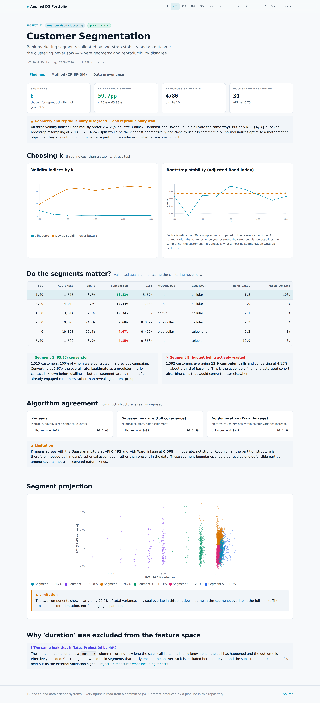

# 02 · Customer Segmentation with Stability Testing

Segments over **41,188 real marketing contacts** from a Portuguese retail bank, selected for
*reproducibility* rather than for geometry, and validated against an outcome the clustering
never saw.

| Dataset | Kind | Size | Origin | Licence |
|---|:---:|---|---|---|
| [Bank Marketing — Portuguese Term Deposit Campaigns (2008–2010)](https://raw.githubusercontent.com/selva86/datasets/master/bank-full.csv) | 🟢 **REAL** | 41,188 contacts, 4,640 subscriptions (11.27%) | Direct marketing call records from a Portuguese retail bank, collected May 2008 – November 2010 and published by Moro, Cortez & Rita (2014). Each row is one real client contacted by phone; the target is whether they subscribed to a term deposit. Includes contemporaneous macroeconomic indicators (euribor3m, employment variation rate, consumer confidence). | Creative Commons Attribution 4.0 (UCI Machine Learning Repository). |

## The problem with clustering

Clustering has no ground truth, which makes it the easiest analysis to fool yourself with.
Run K-means with k=4, colour a scatter plot, name four personas, and the output looks
authoritative whether or not the structure is real.

Three defences were applied. The second is the one most segmentation work omits.

1. **Three validity indices, allowed to disagree** — silhouette, Calinski-Harabasz and
   Davies-Bouldin reward different things.
2. **Bootstrap stability.** Every candidate k was recomputed over 30
   resamples and compared by adjusted Rand index. A partition that changes when you resample
   the same population describes the sample, not the customers.
3. **External validation.** Subscription outcome was excluded from the feature space
   entirely and used only afterwards, to ask whether the segments differ in a way the
   business cares about.

## Geometry and reproducibility disagreed

| Criterion | Preferred k |
|---|---|
| Silhouette | 2 |
| Calinski-Harabasz | 2 |
| Davies-Bouldin | 2 |
| **Bootstrap stability (ARI ≥ 0.75)** | **6, 7** |

All three indices unanimously prefer **k = 2**. Only
**k ∈ {6, 7}** reproduces under resampling.

`k = 6` was taken. A two-way split would be geometrically cleanest and
commercially useless — internal indices optimise a mathematical objective, not a business
one, and they say nothing about whether a partition survives a new sample.

## Do the segments matter?

The clustering never saw subscription outcome. These differences are therefore genuine
external validation rather than a restatement of the objective the algorithm optimised.

| Seg | Customers | Share | Conversion | Lift | Modal job | Contact | Mean calls | Prior contact |
|---:|---:|---:|---:|---:|---|---|---:|---:|
| 1 | 1,515 | 3.7% | **63.83%** | 5.67× | admin. | cellular | 1.8 | 100% |
| 3 | 4,019 | 9.8% | **12.44%** | 1.10× | admin. | cellular | 2.0 | 0% |
| 4 | 13,314 | 32.3% | **12.34%** | 1.09× | admin. | cellular | 2.1 | 0% |
| 2 | 9,878 | 24.0% | **9.68%** | 0.86× | blue-collar | cellular | 2.2 | 0% |
| 0 | 10,870 | 26.4% | **4.67%** | 0.41× | blue-collar | telephone | 2.2 | 0% |
| 5 | 1,592 | 3.9% | **4.15%** | 0.37× | admin. | telephone | 12.9 | 0% |

**χ² = 4786, p < 1e-300**,
conversion spread **59.7%**.

**The actionable finding is segment 5**, not segment 1.
1,592 customers averaging **12.9 campaign calls**
and converting at 4.15% — roughly a third of baseline. That is
budget being actively consumed by a saturated cohort.

Segment 1 converts at 63.83%, but
100% of it was contacted in a previous campaign. It is a
legitimate predictor — prior contact is known before dialling — but it largely re-identifies
already-engaged customers rather than revealing a latent group.

## Three limitations, stated

**Algorithms only half-agree.** K-means agrees with the Gaussian mixture at ARI
**0.4924** and with Ward linkage at **0.5046**.
Roughly half the partition structure is imposed by K-means's spherical assumption rather than
present in the data. These boundaries are one defensible partition among several.

**The projection cannot be read as separation.** The two components shown carry only 29.9% of total variance, so visual overlap in this plot does not mean the segments overlap in the full space. The projection is for orientation, not for judging separation.

**Segments are descriptive, not causal.** A segment converting at 5× the average is not
evidence that moving a customer into it would raise their probability of subscribing.

## The excluded column

`duration` — how long the sales call lasted — is excluded from the feature space. It is only
known once the call has happened and the outcome is effectively decided. Clustering on it
would build segments that partly encode the answer.
[Project 06](../06_automl_tournament/) measures what including it costs: **+39.9% PR-AUC**.

## Screens




## CRISP-DM record

> **Business question.** Do the bank's contacted customers fall into distinct, reproducible segments — and do those segments differ enough in subscription behaviour to justify targeting them differently?

### Business Understanding

A term-deposit campaign has a fixed calling budget. Segmentation is only worth doing if it changes who gets called, which requires segments that are reproducible and that differ in conversion. A segmentation that is stable but uniform in outcome, or that differs in outcome but is not reproducible, fails to justify itself.

**What makes a segmentation successful here?**

- **Chose:** Bootstrap-stable partitions whose conversion rates differ materially.
- **Why:** Both conditions are necessary. Stability without outcome separation gives tidy segments nobody can act on; outcome separation without stability gives a story that will not reproduce next quarter.
- *Rejected:* Silhouette alone — measures geometry, says nothing about whether the segments matter commercially.
- *Rejected:* Fixing k=4 for interpretability — a convention, not a finding.

### Data Understanding

41,188 real contact records. 9 numeric and 10 categorical attributes describe the customer and the campaign; the subscription outcome is withheld from the feature space and reserved for external validation. Missing values are coded as the literal string 'unknown' rather than as nulls.

**How should 'unknown' categorical values be treated?**

- **Chose:** Kept as an explicit level, not imputed.
- **Why:** 'unknown' is informative here: a customer whose employment or education the bank failed to record differs systematically from one it recorded. Imputing to the mode would erase that signal and manufacture certainty the data does not have.
- *Rejected:* Mode imputation — destroys a real signal and inflates the apparent completeness of the data.
- *Rejected:* Dropping rows with any 'unknown' — would discard a large and non-random share of the population.

**Limitations**

- Macroeconomic columns (euribor3m, emp.var.rate, nr.employed) vary with calendar time rather than with the customer. Including them risks segmenting by *when* someone was called rather than by who they are — examined in the feature-set ablation below.

### Data Preparation

Numeric features standardised and categoricals one-hot encoded with rare levels folded together, all inside a ColumnTransformer. Two candidate feature sets were carried forward — customer attributes alone, and customer attributes plus macroeconomic context — because whether the macro columns describe the customer or merely the calendar is a real judgement call.

**Include macroeconomic indicators in the feature space?**

- **Chose:** Selected feature set: customer_only.
- **Why:** euribor3m and nr.employed vary with the date of the call, not with the person. Including them risks producing segments that are really time periods wearing customer labels. Both variants were swept and the choice is made on stability rather than asserted up front.

### Modeling

k swept over 2–10 against three validity indices for both feature sets, then every k stress-tested with 30 bootstrap resamples. Three algorithms with different geometric assumptions were fitted at the selected k=6.

**How is k chosen?**

- **Chose:** k=6, the best-silhouette k among those passing the ARI ≥ 0.75 stability bar.
- **Why:** Validity indices alone can favour a k whose partition changes entirely under resampling. Requiring reproducibility first, and optimising geometry second, prevents reporting a segmentation that describes this sample rather than this population.
- *Rejected:* Elbow method on inertia — inertia decreases monotonically and the 'elbow' is read by eye, so it is not a criterion.
- *Rejected:* Highest silhouette outright — ignores whether the partition reproduces.

### Evaluation

Conversion ranges from 4.15% to 63.83% across segments (χ²=4786.4, p=0.00e+00). The clustering never saw the outcome, so this separation is genuine external validation rather than a restatement of the objective the algorithm optimised.

**Limitations**

- The three validity indices unanimously prefer k=2, while the bootstrap admits only k∈[6, 7]. Geometry and reproducibility disagree, and the reproducible answer was taken. A k=2 split would be the cleanest geometrically and would also be nearly useless commercially, which is a reminder that internal indices optimise a mathematical objective rather than a business one.
- K-means agrees with GMM at ARI 0.4924 and with Ward linkage at 0.5046 — moderate, not strong. Roughly half the partition structure is therefore imposed by K-means's spherical assumption rather than present in the data. Segment boundaries should be treated as one defensible partition among several, not as discovered natural kinds.
- The highest-converting segment is defined largely by having been contacted in a previous campaign (100% prior-contact share). That is a legitimate predictor — it is known before the call is placed — but it means the segment mostly re-identifies already-engaged customers rather than revealing a latent group.
- Segments are descriptive, not causal. A segment converting at 3× the average is not evidence that moving a customer into it would raise their probability of subscribing.
- One institution, one product, 2008–2010, during a financial crisis. Segment structure is unlikely to transfer.

### Deployment

Segment centroids and profiles are exported so the published explorer can assign a new customer to a segment in the browser and show its conversion history, with the stability caveat displayed alongside.


## Run it

```bash
git clone https://github.com/Pranjal101Shrivastava/Projects
cd Projects
pip install -r requirements.txt
export PYTHONPATH=lib

python3 projects/02_customer_segmentation/pipeline/build.py   # rebuilds every artifact below
python3 tools/audit.py                          # static leakage audit
```

Datasets download on first run into `.data/` and are verified against their recorded
SHA-256 on every run thereafter. The pipeline is seeded, so a rerun at the same commit
reproduces the same numbers.

---

**Live:** [https://pranjal101shrivastava.github.io/Projects/#/p/segmentation](https://pranjal101shrivastava.github.io/Projects/#/p/segmentation) *(requires GitHub Pages enabled)* ·
**Method:** [`pipeline/build.py`](./pipeline/build.py) ·
**Audit:** [`audit.md`](./audit.md) ·
**Artifacts:** [`artifacts/`](./artifacts/)

*Generated at commit `4aa8c30` · seed 42 · 347.5s · Python 3.11.15 · numpy 2.4.6 · pandas 3.0.5 · sklearn 1.9.1 · lightgbm 4.7.0*
