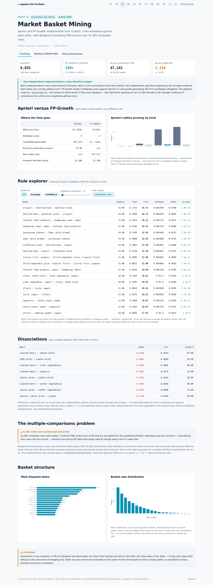

# 03 · Market Basket Mining with FDR Control

Association rules over **9,835 real grocery baskets**, with Apriori and
FP-Growth implemented from first principles and cross-validated against each other, and every
reported rule passing Benjamini-Hochberg false-discovery-rate control.

| Dataset | Kind | Size | Origin | Licence |
|---|:---:|---|---|---|
| [Groceries Market Basket Transactions](https://raw.githubusercontent.com/stedy/Machine-Learning-with-R-datasets/master/groceries.csv) | 🟢 **REAL** | 9,835 transactions over 169 item categories | One month of real point-of-sale transactions from a grocery outlet, distributed with the R 'arules' package (Hahsler et al.). | GPL-2, as distributed with the arules R package. |

## Two algorithms, written from scratch, agreeing exactly

Both were implemented directly rather than imported. The two differ precisely in *how* they
avoid scanning the exponential itemset lattice, and that difference is the substance of the
topic — calling `mlxtend.apriori` would hide it and make the runtime comparison meaningless.

| | Apriori | FP-Growth |
|---|---:|---:|
| Wall-clock | 117.943s | **0.624s** |
| Database scans | 4 | 2 |
| Candidates generated | 267,573 | 0 — none |
| Pruned by downward closure | 72.0% | n/a |
| Tree nodes built | n/a | 121,317 |
| **Frequent itemsets found** | **13,106** | **13,106** |

**189× speedup, byte-identical output.**

The agreement is the real result. The pipeline raises `AssertionError` and refuses to write
anything if the two ever diverge — two independent implementations agreeing on all
13,106 itemsets is far stronger evidence of correctness than either one
completing without error.

## The multiple-comparisons problem nobody corrects for

Mining generates tens of thousands of candidate rules, then presents the highest-scoring few.
That is textbook multiple testing: with 169 items there are ~28,000
possible pairs, so rules with striking lift arise by chance alone.

- **52,285** candidate rules tested
- **47,141** survive Fisher exact + Benjamini-Hochberg at α = 0.05
- **5,144 rejected** and excluded from every table below

Bonferroni was rejected deliberately: at this scale it would control family-wise error while
discarding genuine affinities. BH bounds the *expected proportion* of false discoveries among
those reported, which is the right guarantee for a ranked shortlist someone will act on.

The implementation was verified against `statsmodels.multipletests` — maximum absolute
q-value difference **1.1 × 10⁻¹⁶**, identical rejection sets.

## Top affinities (significant only)

| Rule | Baskets | Confidence | Lift | Leverage | Zhang | q-value |
|---|---:|---:|---:|---:|---:|---:|
| `{liquor}` → `{bottled beer, red/blush wine}` | 19 | 0.174 | **35.72** | 0.00188 | 0.977 | 5.77e-23 |
| `{bottled beer, red/blush wine}` → `{liquor}` | 19 | 0.396 | **35.72** | 0.00188 | 0.983 | 5.77e-23 |
| `{Instant food products}` → `{hamburger meat, soda}` | 12 | 0.152 | **26.21** | 0.00117 | 0.968 | 1.06e-12 |
| `{hamburger meat, soda}` → `{Instant food products}` | 12 | 0.211 | **26.21** | 0.00117 | 0.970 | 1.06e-12 |
| `{processed cheese}` → `{ham, white bread}` | 19 | 0.117 | **22.93** | 0.00185 | 0.961 | 2.55e-19 |
| `{ham, white bread}` → `{processed cheese}` | 19 | 0.380 | **22.93** | 0.00185 | 0.973 | 2.55e-19 |
| `{red/blush wine}` → `{bottled beer, liquor}` | 19 | 0.101 | **21.49** | 0.00184 | 0.958 | 6.27e-19 |
| `{bottled beer, liquor}` → `{red/blush wine}` | 19 | 0.413 | **21.49** | 0.00184 | 0.972 | 6.27e-19 |

These are interpretable, which is the real test: an alcohol basket, a convenience-meal
basket, and a sandwich basket.

## Dissociations — pairs bought together *less* than chance

| Rule | Baskets | Confidence | Lift | Leverage | Zhang | q-value |
|---|---:|---:|---:|---:|---:|---:|
| `{canned beer}` → `{whole milk}` | 87 | 0.114 | **0.45** | -0.01100 | -0.626 | 1.00e+00 |
| `{UHT-milk}` → `{whole milk}` | 39 | 0.119 | **0.46** | -0.00458 | -0.608 | 1.00e+00 |
| `{canned beer}` → `{root vegetables}` | 40 | 0.052 | **0.48** | -0.00440 | -0.548 | 1.00e+00 |
| `{canned beer}` → `{yogurt}` | 53 | 0.069 | **0.50** | -0.00545 | -0.540 | 1.00e+00 |
| `{white wine}` → `{whole milk}` | 26 | 0.139 | **0.54** | -0.00221 | -0.529 | 1.00e+00 |

Lift below 1 signals negative association but compresses it into a narrow range bounded
below by zero. Zhang's metric spans [−1, 1] and separates these properly. Beer dissociating
from milk and vegetables is the clearest case: those are different shopping trips, not
complementary products.

## Why six measures

No single measure is sufficient, and ranking by confidence is the classic mistake.

- **Confidence** P(Y|X) ignores how common Y is. "Anything → whole milk" reaches ~25%
  confidence purely because a quarter of baskets contain milk.
- **Lift** corrects for that but is symmetric and unstable at low support.
- **Conviction** is directional, unlike lift.
- **Leverage** is absolute excess co-occurrence, so high-volume rules are not buried under
  high-lift rarities.
- **Zhang's metric** distinguishes association from dissociation.
- **q-value** says whether the rule is distinguishable from noise at all.

## Why the support floor is 0.1% and not 1%

The transaction matrix is **97.4% sparse** — mean basket
4.409 items out of 169 categories. A
conventional 1% floor admits only the handful of staples everyone buys, and every rule found
becomes a variation on "people buy milk". Lowering the floor surfaces the niche affinities
where merchandising value actually is; the FDR correction is what makes that trade safe.

## Screens




## CRISP-DM record

> **Business question.** Which grocery items are bought together more often than chance explains, and which of those affinities are strong enough — and statistically solid enough — to justify changing shelf layout or a promotion?

### Business Understanding

Cross-sell placement and bundle promotions both hinge on knowing which products genuinely pull each other into the basket. The commercial risk is acting on a spurious pattern: rearranging an aisle around a rule that was noise costs real money and is hard to detect after the fact.

**What makes a rule actionable rather than merely high-scoring?**

- **Chose:** It must clear a lift threshold AND survive FDR correction AND carry enough absolute volume (leverage) to matter.
- **Why:** Lift alone rewards rare coincidences: two items appearing together in 3 of 9,835 baskets can show lift above 20. Requiring statistical significance rules out noise, and requiring leverage rules out patterns too small to be worth a merchandising change.
- *Rejected:* Rank by confidence — dominated by whatever is popular overall; 'anything → whole milk' scores well and means nothing.
- *Rejected:* Rank by lift alone — surfaces rare coincidences with no volume.

### Data Understanding

9,835 real point-of-sale baskets over 169 item categories. Mean basket 4.409 items; the transaction matrix is 97.39% sparse, which is why a low support floor is necessary to see anything beyond staples.

**Why set minimum support as low as 0.1%?**

- **Chose:** 0.1% ≈ 9 baskets.
- **Why:** At 97% sparsity a conventional 1% floor admits only the handful of staples everyone buys, and every rule found is a variation on 'people buy milk'. Lowering the floor surfaces niche affinities — which is where merchandising value is — at the cost of many more candidate rules. The FDR correction is what makes that trade safe.
- *Rejected:* 1% support — yields only staple combinations, no actionable niche findings.

**Limitations**

- One month from one outlet. Seasonal affinities and store-specific assortment are baked in and will not generalise to other stores.
- Items are categories, not SKUs, so within-category substitution (two brands of yogurt) is invisible.

### Data Preparation

Minimal by design: the source is already one transaction per line. Parsing splits on commas, trims whitespace and drops empty baskets. No item is merged or renamed, so item identity matches the source.

### Modeling

Apriori and FP-Growth both implemented from scratch and run on identical input; they agree on all 13,106 frequent itemsets. 52,285 candidate rules were generated and scored on six measures, then filtered by Fisher exact tests under Benjamini-Hochberg FDR control.

**Why implement both algorithms rather than use a library?**

- **Chose:** Both written from first principles.
- **Why:** The two differ precisely in how they avoid the exponential lattice, and that difference is the substance of the topic. Running both also yields a genuine correctness check: independent implementations agreeing on all 13,106 itemsets is stronger evidence than either completing without error.
- *Rejected:* mlxtend.apriori — hides the mechanism and makes the runtime comparison meaningless.

**How is multiple testing handled?**

- **Chose:** Benjamini-Hochberg FDR at α=0.05, not Bonferroni.
- **Why:** 52,285 simultaneous tests make some striking lifts inevitable by chance. Bonferroni would control the family-wise error rate but reject nearly everything including real affinities. BH bounds the expected proportion of false discoveries in the shortlist, which is the right guarantee for a ranked list someone will act on.
- *Rejected:* No correction — the standard practice, and the reason published rule tables are often mostly noise.
- *Rejected:* Bonferroni — too conservative at this scale.

### Evaluation

47,141 of 52,285 rules survive FDR correction (5,144 rejected). Strongest surviving affinity: {liquor} → {bottled beer, red/blush wine} at lift 35.72.

**Limitations**

- Association is not causation. A lift of 3 between two items does not mean moving one next to the other will raise sales of the other; it may only mean both are bought on the same kind of shopping trip.
- Rules are mined and evaluated on the same transactions. A holdout split would test whether affinities persist across periods, which one month of data does not support.

### Deployment

Rules ship as JSON with every measure attached, driving an interactive rule explorer and a force-directed affinity graph. The explorer exposes the significance filter as a control so a user can see how many rules the FDR correction removes.


## Run it

```bash
git clone https://github.com/Pranjal101Shrivastava/Projects
cd Projects
pip install -r requirements.txt
export PYTHONPATH=lib

python3 projects/03_market_basket/pipeline/build.py   # rebuilds every artifact below
python3 tools/audit.py                          # static leakage audit
```

Datasets download on first run into `.data/` and are verified against their recorded
SHA-256 on every run thereafter. The pipeline is seeded, so a rerun at the same commit
reproduces the same numbers.

---

**Live:** [https://pranjal101shrivastava.github.io/Projects/#/p/market-basket](https://pranjal101shrivastava.github.io/Projects/#/p/market-basket) *(requires GitHub Pages enabled)* ·
**Method:** [`pipeline/build.py`](./pipeline/build.py) ·
**Audit:** [`audit.md`](./audit.md) ·
**Artifacts:** [`artifacts/`](./artifacts/)

*Generated at commit `b949297` · seed 42 · 130.63s · Python 3.11.15 · numpy 2.4.6 · pandas 3.0.5 · sklearn 1.9.1 · lightgbm 4.7.0*
