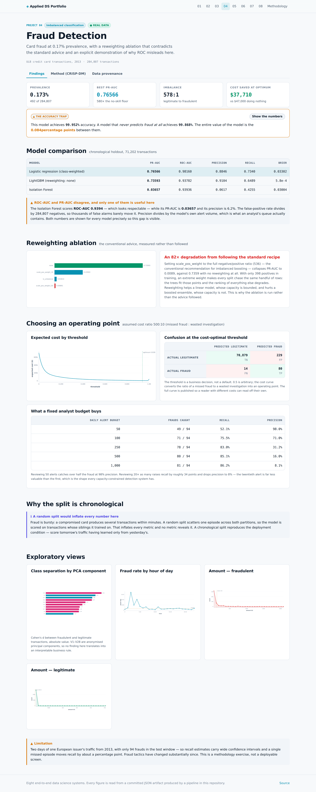
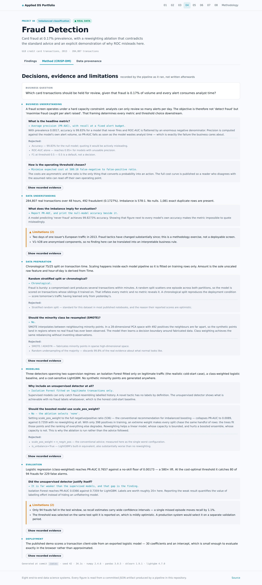

# 04 · Fraud Detection at 0.17% Prevalence

Card fraud detection over **284,807 real transactions** from the
Université Libre de Bruxelles dataset, where 492 are fraudulent — an imbalance
of **578:1**.

| Dataset | Kind | Size | Origin | Licence |
|---|:---:|---|---|---|
| [Credit Card Fraud Detection (ULB, Sep 2013)](https://raw.githubusercontent.com/nsethi31/Kaggle-Data-Credit-Card-Fraud-Detection/master/creditcard.csv) | 🟢 **REAL** | 284,807 transactions, 492 fraudulent (0.1727%) | Machine Learning Group, Universite Libre de Bruxelles. Real card transactions by European cardholders over two days in September 2013. V1-V28 are PCA components published in place of the raw features for confidentiality; Time and Amount are unmodified. | Open Database License (ODbL) - research and educational use. |

## Everything here follows from one number

The positive rate is **0.1727%**. That single fact determines every
design decision:

- **Accuracy is meaningless.** A model that predicts "never fraud" scores
  99.827%.
- **ROC-AUC is misleading.** Its false-positive rate divides by
  284,315 negatives, so thousands of false alarms barely
  move it.
- **The threshold is a business decision**, not a default. 0.5 is arbitrary.

## Results

Chronological holdout: 71,202
transactions, 94 frauds.

| Model | PR-AUC | ROC-AUC | Precision | Recall | Brier |
|---|---:|---:|---:|---:|---:|
| Logistic regression (class-weighted) | 0.7657 | 0.9816 | 0.885 | 0.734 | 0.03302 |
| LightGBM (reweighting: none) | 0.7359 | 0.9378 | 0.910 | 0.649 | 0.00058 |
| Isolation Forest | 0.0366 | 0.9394 | 0.062 | 0.426 | 0.03004 |

**PR-AUC 0.7657 against a no-skill floor of 0.00132** — a
580× lift.

The floor is the prevalence *of the held-out window* (0.00132), not of the
full dataset (0.00173); a chronological split does not preserve the base rate
exactly, and the no-skill PR-AUC is always the prevalence of the set being scored.

### The metric gap, shown rather than described

The Isolation Forest scores **ROC-AUC 0.9394** — which looks respectable —
while its **PR-AUC is 0.0366** and its precision is 6.2%.

Same model. Same predictions. The two metrics disagree because ROC's denominator is every
negative in the dataset, while precision's denominator is the model's own alert volume —
which is what an analyst's queue actually contains. Both are reported for every model
precisely so this gap is visible.

### The accuracy trap

| | |
|---|---:|
| This model's accuracy | 99.952% |
| Accuracy of predicting "never fraud" | 99.868% |
| **The entire value of the model** | **0.084 points** |

## An ablation that contradicts the standard advice

The conventional recommendation for imbalanced boosting is to set `scale_pos_weight` to the
negative/positive ratio. On this data that is the single worst thing you can do.

| Variant | scale_pos_weight | PR-AUC | ROC-AUC |
|---|---:|---:|---:|
| `none` | — | **0.7359** | 0.9378 |
| `scale_pos_weight_10` | 10 | **0.2359** | 0.8652 |
| `is_unbalance` | — | **0.0181** | 0.8284 |
| `scale_pos_weight_full` | 536 | **0.0089** | 0.8792 |

Setting scale_pos_weight to the full negative/positive ratio (536) — the conventional recommendation for imbalanced boosting — collapses PR-AUC to 0.0089, against 0.7359 with no reweighting at all. With only 398 positives in training, an extreme weight makes every split chase the same handful of rows: the trees fit those points and the ranking of everything else degrades. Reweighting helps a linear model, whose capacity is bounded, and hurts a boosted ensemble, whose capacity is not. This is why the ablation is run rather than the advice followed.

All four variants are published rather than only the winner.

## Choosing an operating point

Assumed costs: **500** for a missed fraud,
**10** for a wasted investigation. The ratio is an
assumption, not a measurement — the full curve ships in
[`artifacts/cost.json`](./artifacts/cost.json) so a reader with different costs can read off
their own point.

At the cost-optimal threshold of **0.939**:
80 frauds caught, 229
false alarms, 14 missed.

### What a fixed analyst budget buys

| Daily alert budget | Frauds caught | Recall | Precision |
|---:|---:|---:|---:|
| 50 | 49 / 94 | 52.1% | 98.0% |
| 100 | 71 / 94 | 75.5% | 71.0% |
| 250 | 78 / 94 | 83.0% | 31.2% |
| 500 | 80 / 94 | 85.1% | 16.0% |
| 1,000 | 81 / 94 | 86.2% | 8.1% |

Reviewing 50 alerts catches over half the fraud at 98.0%
precision. Reviewing twenty times as many raises recall by about
34
points and drops precision to 8.1%. The
twentieth alert is far less valuable than the first — the shape every capacity-constrained
detection system has.

## Why the split is chronological

Fraud is bursty: a compromised card produces several transactions within minutes. A random split scatters one episode across both partitions, so the model is scored on transactions whose siblings it trained on. That inflates every metric and no metric reveals it. A chronological split reproduces the deployment condition — score tomorrow's traffic having learned only from yesterday's.

Most published notebooks on this dataset use a stratified random split, which is why their
reported numbers are better than these.

## Why not SMOTE

Interpolating between 492 positives in 28-dimensional PCA space places
synthetic points in regions where no real fraud has ever been observed, and the model then
learns a decision boundary around fabricated data. Class weighting achieves the same
rebalancing without inventing observations.

## Screens






## CRISP-DM record

> **Business question.** Which card transactions should be held for review, given that fraud is 0.17% of volume and every alert consumes analyst time?

### Business Understanding

A fraud screen operates under a hard capacity constraint: analysts can only review so many alerts per day. The objective is therefore not 'detect fraud' but 'maximise fraud caught per alert raised'. That framing determines every metric and threshold choice downstream.

**What is the headline metric?**

- **Chose:** Average precision (PR-AUC), with recall at a fixed alert budget.
- **Why:** With prevalence 0.0017, accuracy is 99.83% for a model that never fires and ROC-AUC is flattered by an enormous negative denominator. Precision is computed against the model's own alert volume, so PR-AUC falls as soon as the model wastes analyst time — which is exactly the failure the business cares about.
- *Rejected:* Accuracy — 99.83% for the null model; quoting it would be actively misleading.
- *Rejected:* ROC-AUC alone — reaches 0.95+ for models with unusable precision.
- *Rejected:* F1 at threshold 0.5 — 0.5 is a default, not a decision.

**How is the operating threshold chosen?**

- **Chose:** Minimise expected cost at 500:10 false-negative to false-positive ratio.
- **Why:** The costs are asymmetric and the ratio is the only thing that converts a probability into an action. The full cost curve is published so a reader who disagrees with the assumed ratio can read off their own operating point.

### Data Understanding

284,807 real transactions over 48 hours, 492 fraudulent (0.1727%). Imbalance is 578:1. No nulls. 1,081 exact duplicate rows are present.

**What does the imbalance imply for evaluation?**

- **Chose:** Report PR-AUC, and print the null-model accuracy beside it.
- **Why:** A model predicting 'never fraud' achieves 99.8273% accuracy. Showing that figure next to every model's own accuracy makes the metric impossible to quote misleadingly.

**Limitations**

- Two days of one issuer's European traffic in 2013. Fraud tactics have changed substantially since; this is a methodology exercise, not a deployable screen.
- V1–V28 are anonymised components, so no finding here can be translated into an interpretable business rule.

### Data Preparation

Chronological 75/25 split on transaction time. Scaling happens inside each model pipeline so it is fitted on training rows only. Amount is the sole unscaled raw feature and hour-of-day is derived from Time.

**Random stratified split or chronological?**

- **Chose:** Chronological.
- **Why:** Fraud is bursty: a compromised card produces several transactions within minutes. A random split scatters one episode across both partitions, so the model is scored on transactions whose siblings it trained on. That inflates every metric and no metric reveals it. A chronological split reproduces the deployment condition — score tomorrow's traffic having learned only from yesterday's.
- *Rejected:* Stratified random split — standard for this dataset in most published notebooks, and the reason their reported scores are optimistic.

**Should the minority class be resampled (SMOTE)?**

- **Chose:** No.
- **Why:** SMOTE interpolates between neighbouring minority points. In a 28-dimensional PCA space with 492 positives the neighbours are far apart, so the synthetic points land in regions where no real fraud has ever been observed. The model then learns a decision boundary around fabricated data. Class weighting achieves the same rebalancing without inventing observations.
- *Rejected:* SMOTE / ADASYN — fabricates minority points in sparse high-dimensional space.
- *Rejected:* Random undersampling of the majority — discards 99.8% of the real evidence about what normal looks like.

### Modeling

Three detectors spanning two supervision regimes: an Isolation Forest fitted only on legitimate traffic (the realistic cold-start case), a class-weighted logistic baseline, and a cost-sensitive LightGBM. No synthetic minority points are generated anywhere.

**Why include an unsupervised detector at all?**

- **Chose:** Isolation Forest fitted on legitimate transactions only.
- **Why:** Supervised models can only catch fraud resembling labelled history. A novel tactic has no labels by definition. The unsupervised detector shows what is achievable with no fraud labels whatsoever, which is the honest cold-start baseline.

**Should the boosted model use scale_pos_weight?**

- **Chose:** No — the ablation selects 'none'.
- **Why:** Setting scale_pos_weight to the full negative/positive ratio (536) — the conventional recommendation for imbalanced boosting — collapses PR-AUC to 0.0089, against 0.7359 with no reweighting at all. With only 398 positives in training, an extreme weight makes every split chase the same handful of rows: the trees fit those points and the ranking of everything else degrades. Reweighting helps a linear model, whose capacity is bounded, and hurts a boosted ensemble, whose capacity is not. This is why the ablation is run rather than the advice followed.
- *Rejected:* scale_pos_weight = n_neg/n_pos — the conventional advice; measured here as the single worst configuration.
- *Rejected:* is_unbalance=True — LightGBM's built-in equivalent, also substantially worse than no reweighting.

### Evaluation

Logistic regression (class-weighted) reaches PR-AUC 0.7657 against a no-skill floor of 0.00173 — a 580× lift. At the cost-optimal threshold it catches 80 of 94 frauds for 229 false alarms.

**Did the unsupervised detector justify itself?**

- **Chose:** It is far weaker than the supervised models, and that gap is the finding.
- **Why:** Isolation Forest reaches PR-AUC 0.0366 against 0.7359 for LightGBM. Labels are worth roughly 20× here. Reporting the weak result quantifies the value of labelling effort instead of hiding an unflattering model.

**Limitations**

- Only 94 frauds fall in the test window, so recall estimates carry wide confidence intervals — a single missed episode moves recall by 1.1%.
- The threshold was selected on the same test split it is reported on, which is mildly optimistic. A production system would select it on a separate validation period.

### Deployment

The published demo scores a transaction client-side from an exported logistic model — 30 coefficients and an intercept, which is small enough to evaluate exactly in the browser rather than approximated.


## Run it

```bash
git clone https://github.com/Pranjal101Shrivastava/Projects
cd Projects
pip install -r requirements.txt
export PYTHONPATH=lib

python3 projects/04_fraud_detection/pipeline/build.py   # rebuilds every artifact below
python3 tools/audit.py                          # static leakage audit
```

Datasets download on first run into `.data/` and are verified against their recorded
SHA-256 on every run thereafter. The pipeline is seeded, so a rerun at the same commit
reproduces the same numbers.

---

**Live:** [https://pranjal101shrivastava.github.io/Projects/#/p/fraud](https://pranjal101shrivastava.github.io/Projects/#/p/fraud) ·
**Method:** [`pipeline/build.py`](./pipeline/build.py) ·
**Audit:** [`audit.md`](./audit.md) ·
**Artifacts:** [`artifacts/`](./artifacts/)

*Generated at commit `22d5161` · seed 42 · 34.06s · Python 3.11.15 · numpy 2.4.6 · pandas 3.0.5 · sklearn 1.9.1 · lightgbm 4.7.0*
