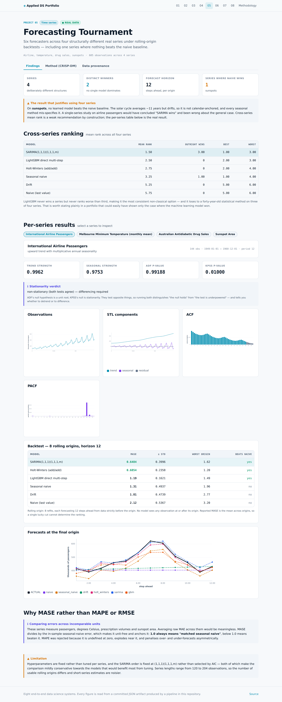

# 05 · Forecasting Tournament across Four Real Series

Six forecasters evaluated on four structurally different real series under rolling-origin
backtests, refitted at every origin rather than scored on a single arbitrary split.

| Dataset | Kind | Size | Origin | Licence |
|---|:---:|---|---|---|
| [International Airline Passengers (1949-1960)](https://raw.githubusercontent.com/jbrownlee/Datasets/master/airline-passengers.csv) | 🟢 **REAL** | 144 monthly observations | Box & Jenkins, 'Time Series Analysis: Forecasting and Control' (1976), series G. Monthly totals of international airline passengers. | Public domain. |
| [Daily Minimum Temperatures, Melbourne (1981-1990)](https://raw.githubusercontent.com/jbrownlee/Datasets/master/daily-min-temperatures.csv) | 🟢 **REAL** | 3,650 daily observations | Australian Bureau of Meteorology, via Hyndman's Time Series Data Library. | Public domain. |
| [Antidiabetic Drug Sales, Australia (1991-2008)](https://raw.githubusercontent.com/selva86/datasets/master/a10.csv) | 🟢 **REAL** | 204 monthly observations | Australian Health Insurance Commission, published in Hyndman & Athanasopoulos, 'Forecasting: Principles and Practice' as series a10. | Public domain (fpp text data). |
| [Sunspot Area (1875-2015)](https://raw.githubusercontent.com/selva86/datasets/master/sunspotarea.csv) | 🟢 **REAL** | 141 annual observations | Royal Observatory Greenwich / NASA Marshall solar cycle observations. | Public domain. |

## Why four series

Most forecasting write-ups evaluate on one series and one holdout, which cannot separate
"this model is good" from "this model happens to suit this series". The four here were
chosen to differ in structure:

- **International Airline Passengers** — upward trend with multiplicative annual seasonality
- **Melbourne Minimum Temperature (monthly mean)** — strong annual seasonality, no trend
- **Australian Antidiabetic Drug Sales** — trend with a sharp December spike
- **Sunspot Area** — ~11 year cycle, not calendar-anchored

## The result that justifies the design

**On 1 of 4 series, no learned model beats the naive baseline.**

The sunspot cycle averages about eleven years but drifts, so it is not calendar-anchored and
every seasonal method mis-specifies it. A single-series study on airline passengers would
have concluded "SARIMA wins" and been wrong about the general case.

## Cross-series ranking

| Model | Mean rank | Outright wins | Best | Worst |
|---|---:|---:|---:|---:|
| SARIMA(1,1,1)(1,1,1,m) | 1.50 | 3 | 1 | 3 |
| LightGBM direct multi-step | 2.50 | 0 | 2 | 3 |
| Holt-Winters (add/add) | 2.75 | 0 | 2 | 4 |
| Seasonal naive | 3.25 | 1 | 1 | 4 |
| Drift | 5.25 | 0 | 5 | 6 |
| Naive (last value) | 5.75 | 0 | 5 | 6 |

Mean rank across four structurally different series is a weak recommendation by construction.
The per-series tables below are the real result.

Worth noting: **LightGBM never wins a series but never ranks worse than third**, making it the
most consistent non-classical option — and it loses to a forty-year-old statistical method on
three of four series.

## Per-series results

### International Airline Passengers

*upward trend with multiplicative annual seasonality* · 144 observations · 1949-01-01 → 1960-12-01 ·
period 12

Trend strength 0.996 · seasonal strength 0.975 ·
ADF p = 0.9919 · KPSS p = 0.0100

**Stationarity:** non-stationary (both tests agree) — differencing required

| Model | MASE | ± std | Worst origin | Beats naive |
|---|---:|---:|---:|:---:|
| SARIMA(1,1,1)(1,1,1,m) | 0.648 | ±0.400 | 1.624 | ✅ |
| Holt-Winters (add/add) | 0.685 | ±0.236 | 1.201 | ✅ |
| LightGBM direct multi-step | 1.187 | ±0.162 | 1.488 | ✅ |
| Seasonal naive | 1.313 | ±0.494 | 1.959 | — |
| Drift | 1.813 | ±0.474 | 2.766 | — |
| Naive (last value) | 2.119 | ±0.537 | 3.196 | — |
### Melbourne Minimum Temperature (monthly mean)

*strong annual seasonality, no trend* · 120 observations · 1981-01-01 → 1990-12-01 ·
period 12

Trend strength 0.256 · seasonal strength 0.950 ·
ADF p = 0.3357 · KPSS p = 0.1000

**Stationarity:** conflicting: ADF cannot reject a unit root but KPSS cannot reject stationarity — the series is likely difference-stationary but the tests are underpowered here

| Model | MASE | ± std | Worst origin | Beats naive |
|---|---:|---:|---:|:---:|
| SARIMA(1,1,1)(1,1,1,m) | 0.894 | ±0.274 | 1.277 | ✅ |
| LightGBM direct multi-step | 0.920 | ±0.225 | 1.291 | ✅ |
| Holt-Winters (add/add) | 0.925 | ±0.271 | 1.331 | ✅ |
| Seasonal naive | 0.926 | ±0.207 | 1.227 | — |
| Drift | 2.687 | ±0.578 | 4.004 | — |
| Naive (last value) | 2.892 | ±0.591 | 4.132 | — |
### Australian Antidiabetic Drug Sales

*trend with a sharp December spike* · 204 observations · 1991-07-01 → 2008-06-01 ·
period 12

Trend strength 0.985 · seasonal strength 0.854 ·
ADF p = 1.0000 · KPSS p = 0.0100

**Stationarity:** non-stationary (both tests agree) — differencing required

| Model | MASE | ± std | Worst origin | Beats naive |
|---|---:|---:|---:|:---:|
| SARIMA(1,1,1)(1,1,1,m) | 1.116 | ±0.497 | 2.088 | ✅ |
| Holt-Winters (add/add) | 1.124 | ±0.470 | 2.136 | ✅ |
| LightGBM direct multi-step | 1.593 | ±0.284 | 1.994 | ✅ |
| Seasonal naive | 1.915 | ±0.711 | 3.129 | — |
| Drift | 2.345 | ±0.535 | 3.580 | — |
| Naive (last value) | 2.582 | ±0.556 | 3.926 | — |
### Sunspot Area

*~11 year cycle, not calendar-anchored* · 137 observations · 1875-01-01 → 2011-01-01 ·
period 11

Trend strength 0.301 · seasonal strength 0.694 ·
ADF p = 0.4767 · KPSS p = 0.0529

**Stationarity:** conflicting: ADF cannot reject a unit root but KPSS cannot reject stationarity — the series is likely difference-stationary but the tests are underpowered here

| Model | MASE | ± std | Worst origin | Beats naive |
|---|---:|---:|---:|:---:|
| Seasonal naive | 1.501 | ±0.349 | 2.255 | — |
| LightGBM direct multi-step | 1.692 | ±0.382 | 2.157 | — |
| SARIMA(1,1,1)(1,1,1,m) | 1.797 | ±0.656 | 2.997 | — |
| Holt-Winters (add/add) | 1.841 | ±0.642 | 3.218 | — |
| Naive (last value) | 2.408 | ±0.623 | 3.660 | — |
| Drift | 2.425 | ±0.630 | 3.688 | — |


## Why MASE

These series measure passengers, degrees Celsius, prescription volumes and sunspot area.
Averaging raw MAE across them would be meaningless. MASE divides by the in-sample
seasonal-naive error, making it unit-free and anchored: **1.0 always means "matched seasonal
naive"**.

MAPE was rejected — undefined at zero, explosive near it, and asymmetric between over- and
under-forecasts.

## Protocol

Rolling origin: 8 refits, each forecasting 12 steps ahead from data strictly before the origin. No model sees any observation at or after its origin. Reported MASE is the mean across origins, so a single lucky cut cannot determine the ranking.

The ML forecaster uses **direct multi-step** — a separate model per horizon step — rather than
recursive forecasting. Recursive schemes feed a model its own predictions, so error compounds
over the horizon and the final steps are predictions of predictions.

## Both stationarity tests, and what to do when they conflict

ADF's null hypothesis is a unit root; KPSS's null is stationarity. They test opposite things,
so a single test failing to reject is ambiguous between "the null holds" and "the test is
underpowered". Running both distinguishes trend-stationary from difference-stationary series,
which determines whether to detrend or to difference. Two of these four series produce
conflicting verdicts, and that conflict is reported rather than resolved by picking whichever
test agreed with expectation.

## An aggregation decision worth stating

The Melbourne temperature series is 3,650 daily observations. It is modelled here as 120
monthly means. A seasonal model at m = 365 would have to estimate 365 seasonal lags from ten
cycles of data — infeasible to fit and hopeless to identify. Aggregating preserves the annual
cycle, which is the structure of interest. Quietly setting m = 7 instead would have modelled a
weekly cycle this series does not have.

## Screens




## CRISP-DM record

> **Business question.** Which forecasting method should be the default for a new series, and how much does that answer depend on the structure of the series itself?

### Business Understanding

Forecasting tool selection is usually settled by habit or by a single benchmark. The practical question is narrower and more useful: given a series with an identifiable structure, which family should be reached for first, and when is a classical method still the right answer?

**How can models be compared across series in different units?**

- **Chose:** MASE, scaled by in-sample seasonal-naive error.
- **Why:** Averaging raw MAE across passenger counts, degrees Celsius and prescription volumes is meaningless. MASE is unit-free and anchored: 1.0 always means 'matched seasonal naive', so results are comparable and interpretable at the same time.
- *Rejected:* MAPE — undefined at zero, explodes near it, and asymmetric between over- and under-forecasts.
- *Rejected:* Raw RMSE — not comparable across units.

**Single holdout or rolling origin?**

- **Chose:** Rolling origin with up to 8 refits.
- **Why:** A single split reports where one arbitrary cut happened to fall. Refitting at multiple origins gives a mean and a spread, which is what distinguishes a genuinely better model from a luckier one.

### Data Understanding

Four real series with deliberately different structure: International Airline Passengers (upward trend with multiplicative annual seasonality); Melbourne Minimum Temperature (monthly mean) (strong annual seasonality, no trend); Australian Antidiabetic Drug Sales (trend with a sharp December spike); Sunspot Area (~11 year cycle, not calendar-anchored). Each is decomposed by STL and tested for stationarity with both ADF and KPSS, whose null hypotheses are opposites.

**Why run both ADF and KPSS?**

- **Chose:** Both, with an explicit verdict when they conflict.
- **Why:** ADF's null is a unit root; KPSS's null is stationarity. A single test that fails to reject is ambiguous between 'the null holds' and 'the test is underpowered'. Running both distinguishes trend-stationary from difference-stationary series, which determines whether to detrend or difference.

### Data Preparation

Minimal and identical across series: parse dates, coerce values to float, drop unparseable rows, sort chronologically. No imputation, no outlier removal — a smoothed series would make every model look better than it is, and the sunspot and temperature series contain genuine extremes that a forecaster ought to be judged on.

### Modeling

Six forecasters from three families — naive baselines, classical statistical (Holt-Winters, SARIMA) and machine learning (LightGBM direct multi-step) — each refit at every rolling origin on every series.

**Recursive or direct multi-step for the ML forecaster?**

- **Chose:** Direct — a separate model per horizon step.
- **Why:** Recursive forecasting feeds the model its own predictions, so error compounds over the horizon and the last steps are predictions of predictions. Direct multi-step trains h models and avoids the feedback entirely. It costs h times the training, which at this scale is irrelevant.
- *Rejected:* Recursive one-step — cheaper, but compounding error is the dominant failure mode at horizon 12.

### Evaluation

No single model wins everywhere: 2 different models take first place across the four series. Best mean rank is SARIMA(1,1,1)(1,1,1,m) at 1.5, but it wins outright on only 3 of 4.

**Is there a default model to recommend?**

- **Chose:** SARIMA(1,1,1)(1,1,1,m) as a first attempt, but structure should decide.
- **Why:** Mean rank across four structurally different series is a weak recommendation by construction. The per-series table is the real result: a model that dominates on calendar-seasonal data can rank last on a series whose cycle is not calendar-anchored.

**Limitations**

- Model hyperparameters are fixed rather than tuned per series. Tuning would likely improve the ML forecaster most, so the comparison is mildly conservative towards it.
- SARIMA order is fixed at (1,1,1)(1,1,1,m) rather than selected per series by AIC. A per-series search would be fairer to SARIMA and is the obvious next step.
- Series lengths range from 141 to 3,650 observations, so the number of usable rolling origins differs and short-series estimates are noisier.

### Deployment

Each series ships with its observations, STL components, ACF/PACF and full backtest table, driving a forecast studio where a reader can switch series and model and see the rolling-origin error move.


## Run it

```bash
git clone https://github.com/Pranjal101Shrivastava/Projects
cd Projects
pip install -r requirements.txt
export PYTHONPATH=lib

python3 projects/05_timeseries_forecasting/pipeline/build.py   # rebuilds every artifact below
python3 tools/audit.py                          # static leakage audit
```

Datasets download on first run into `.data/` and are verified against their recorded
SHA-256 on every run thereafter. The pipeline is seeded, so a rerun at the same commit
reproduces the same numbers.

---

**Live:** [https://pranjal101shrivastava.github.io/Projects/#/p/forecasting](https://pranjal101shrivastava.github.io/Projects/#/p/forecasting) ·
**Method:** [`pipeline/build.py`](./pipeline/build.py) ·
**Audit:** [`audit.md`](./audit.md) ·
**Artifacts:** [`artifacts/`](./artifacts/)

*Generated at commit `02a5f5a` · seed 42 · 32.98s · Python 3.11.15 · numpy 2.4.6 · pandas 3.0.5 · sklearn 1.9.1 · lightgbm 4.7.0*
