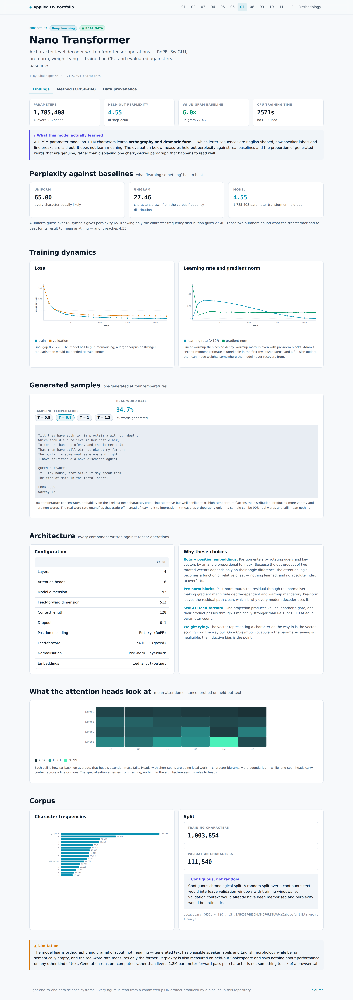

# 07 · A Character Transformer Written from Tensor Operations

A 1,785,408-parameter decoder trained on CPU in
43 minutes, with every component — rotary embeddings, SwiGLU,
pre-norm blocks, weight tying — implemented directly rather than assembled from
`nn.TransformerEncoderLayer`.

| Dataset | Kind | Size | Origin | Licence |
|---|:---:|---|---|---|
| [Tiny Shakespeare](https://raw.githubusercontent.com/karpathy/char-rnn/master/data/tinyshakespeare/input.txt) | 🟢 **REAL** | 1,115,394 characters, 65 distinct | Concatenated public-domain works of Shakespeare, assembled by Andrej Karpathy as the char-rnn reference corpus. | Public domain. |

## Result

| | Perplexity | What it means |
|---|---:|---|
| Uniform guess | 65.00 | every character equally likely |
| Unigram | 27.46 | characters drawn from corpus frequencies |
| **This model** | **4.555** | 1,785,408 parameters, held out |

**6.0× better than the frequency baseline.** The two
baselines are reported because a perplexity figure with no reference point cannot be judged.

## What it actually learned

A 1.79M-parameter model on 1,115,394 characters
learns **orthography and dramatic form** — which letter sequences are English-shaped, how
speaker labels and line breaks are laid out. It does not learn meaning.

Rather than display one cherry-picked paragraph, the real-word rate is measured at four
sampling temperatures:

| Temperature | Words generated | Real words |
|---:|---:|---:|
| 0.5 | 81 | **97.5%** |
| 0.8 | 75 | **94.7%** |
| 1.0 | 73 | **82.2%** |
| 1.3 | 70 | **78.6%** |

The monotone decline is the temperature–coherence trade-off made measurable. Low temperature
concentrates probability on the likeliest next character — repetitive but well-spelled. High
temperature flattens the distribution — more variety, more non-words.

Note what this metric does *not* measure. A sample can be
97.5% real words and mean nothing at all.

## Architecture, and why each piece

| Component | Choice |
|---|---|
| Layers | 4 |
| Attention heads | 6 |
| Model dimension | 192 |
| Feed-forward dimension | 512 |
| Context | 128 characters |
| Position encoding | Rotary (RoPE) |
| Feed-forward | SwiGLU (gated) |
| Normalisation | Pre-norm LayerNorm |
| Embeddings | Tied input/output |

**Rotary position embeddings.** Position enters by *rotating* query and key vectors by an
angle proportional to index. Because the dot product of two rotated vectors depends only on
their angle *difference*, the attention logit becomes a function of relative offset. Nothing
is learned and there is no absolute index to overfit to.

**Pre-norm blocks.** Post-norm routes the residual through the normaliser, making gradient
magnitude depth-dependent and warmup mandatory for stability. Pre-norm leaves the residual
path unobstructed, which is why every modern decoder uses it.

**SwiGLU.** One projection produces values, another a gate, and their product passes through.
Empirically stronger than ReLU or GELU at equal parameter count.

**Weight tying.** The vector representing a character on the way in is the vector scoring it
on the way out. On a 65-symbol vocabulary the parameter saving is
negligible; the inductive bias is the point.

## Attention specialisation

16 of 24 heads attend at a mean distance under 10 characters —
local work like bigrams and word boundaries — while the rest carry context across a line or
more. Nothing in the architecture assigns roles; the specialisation emerges from training.

## Training

1,785,408 parameters, 22 evaluation points over
2571 seconds on CPU. AdamW with linear warmup then cosine decay, gradient
clipping at 1.0.

Final train loss 1.3091, validation 1.5163 —
a gap of 0.2072. The model has begun memorising; a larger corpus or stronger regularisation would be required to train longer.

## A split detail that matters

The corpus is one continuous text. The split is **contiguous**, not random.
Contiguous chronological split. A random split over a continuous text would interleave validation windows with training windows, so validation context would already have been memorised and perplexity would be optimistic.

## Screens




## CRISP-DM record

> **Business question.** What does a four-layer character transformer actually learn from one million characters of Shakespeare on a CPU budget — and how would we know?

### Business Understanding

The objective is pedagogical rather than commercial: build every component of a modern decoder from tensor operations, train it within a few CPU-minutes, and evaluate it honestly. 'Honestly' is the constraint that shapes the work — a language model can always be made to look good by quoting its best sample.

**What claim will be made about the trained model?**

- **Chose:** That it learns orthography and dramatic form, not meaning.
- **Why:** A 1.8M-parameter model on 1.1M characters can learn which letter sequences are English-shaped and how a play is laid out. It cannot learn semantics, and claiming otherwise from a cherry-picked sample would be the standard dishonesty of small-LM demos. The evaluation therefore measures held-out perplexity and the proportion of generated words that are real, rather than displaying one good paragraph.

### Data Understanding

1,115,394 characters, 65 distinct symbols. A uniform guess gives perplexity 65; the character frequency distribution alone gives 27.462. Those two numbers bound what 'learning something' has to mean.

### Data Preparation

Character-level tokenisation with no preprocessing: casing, punctuation and line breaks are all retained, because dramatic layout is part of what the model should learn. Contiguous 90/10 split.

**Character-level or subword tokenisation?**

- **Chose:** Character-level.
- **Why:** A 65-symbol vocabulary keeps the embedding and output layers negligible, so nearly all parameters sit in the transformer blocks where the interesting behaviour is. It also makes spelling an observable achievement rather than something the tokeniser handles invisibly.
- *Rejected:* BPE — better perplexity per compute, but the model would never have to learn to spell, removing the clearest evidence of what it learned.

### Modeling

4-layer pre-norm decoder, 1,785,408 parameters: rotary position embeddings, 6-head causal attention, SwiGLU feed-forward, tied embeddings. AdamW with linear warmup and cosine decay, gradient clipping at 1.0.

**Rotary or learned absolute position embeddings?**

- **Chose:** Rotary (RoPE).
- **Why:** Rotating q and k by an angle proportional to position makes the attention logit depend on relative offset, since the dot product of two rotated vectors is a function of their angle difference. Nothing is learned, and no absolute index exists for the model to overfit to.
- *Rejected:* Learned absolute embeddings — a parameter per position, and no generalisation past the trained context length.
- *Rejected:* Sinusoidal — relative-ish, but added to the residual stream rather than applied where attention actually uses position.

**Pre-norm or post-norm residual blocks?**

- **Chose:** Pre-norm.
- **Why:** Post-norm routes the residual through the normaliser, so gradient magnitude depends on depth and warmup becomes mandatory for stability. Pre-norm keeps an unobstructed residual path, which is why every modern decoder uses it.

### Evaluation

Held-out perplexity 4.555 against 27.462 for a unigram model and 65.0 for uniform guessing — a 6.0× improvement over the frequency baseline. 95% of generated words at T=0.8 are real words from the corpus.

**Limitations**

- The model learns orthography and dramatic layout, not meaning. Generated text has correct-looking speaker labels and plausible English morphology while being semantically empty. Real-word rate measures the former and says nothing about the latter.
- Train and validation loss differ by 0.2072. That gap indicates the model has begun memorising and a larger corpus or stronger regularisation would be needed to train longer.
- Perplexity is measured on held-out Shakespeare. It says nothing about performance on any other kind of text.

### Deployment

Training telemetry, attention statistics and generated samples at four temperatures are exported for the dashboard. Generation itself is not run in the browser — a 1.8M-parameter forward pass per character is not something to ask of a page — so pre-generated samples are shown and labelled as such.


## Run it

```bash
git clone https://github.com/Pranjal101Shrivastava/Projects
cd Projects
pip install -r requirements.txt
export PYTHONPATH=lib

python3 projects/07_nano_transformer/pipeline/build.py   # rebuilds every artifact below
python3 tools/audit.py                          # static leakage audit
```

Datasets download on first run into `.data/` and are verified against their recorded
SHA-256 on every run thereafter. The pipeline is seeded, so a rerun at the same commit
reproduces the same numbers.

---

**Live:** [https://pranjal101shrivastava.github.io/Projects/#/p/transformer](https://pranjal101shrivastava.github.io/Projects/#/p/transformer) *(requires GitHub Pages enabled)* ·
**Method:** [`pipeline/build.py`](./pipeline/build.py) ·
**Audit:** [`audit.md`](./audit.md) ·
**Artifacts:** [`artifacts/`](./artifacts/)

*Generated at commit `1c3d162` · seed 42 · 2583.47s · Python 3.11.15 · numpy 2.4.6 · pandas 3.0.5 · sklearn 1.9.1 · lightgbm 4.7.0 · torch 2.14.0+cu130*
