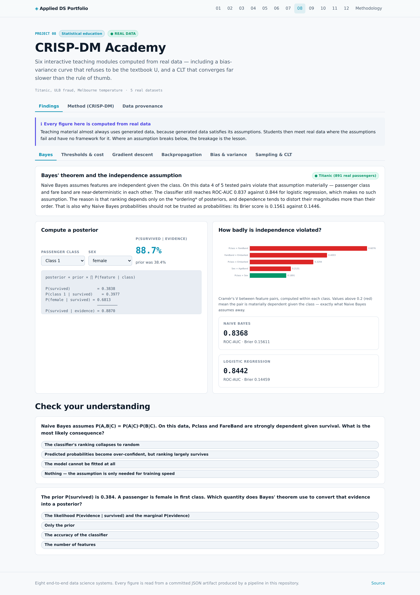

# 08 · CRISP-DM Academy

Six interactive teaching modules in which **every figure is computed from real data**, not
simulated — including the cases where real data refuses to behave like the textbook.

| Dataset | Kind | Size | Origin | Licence |
|---|:---:|---|---|---|
| [Titanic Passenger Manifest](https://raw.githubusercontent.com/datasciencedojo/datasets/master/titanic.csv) | 🟢 **REAL** | 891 passengers | Encyclopedia Titanica passenger records, as compiled for the Vanderbilt Biostatistics dataset archive. Real passengers and real outcomes. | Public domain. |
| [Credit Card Fraud Detection (ULB, Sep 2013)](https://raw.githubusercontent.com/nsethi31/Kaggle-Data-Credit-Card-Fraud-Detection/master/creditcard.csv) | 🟢 **REAL** | 284,807 transactions, 492 fraudulent (0.1727%) | Machine Learning Group, Universite Libre de Bruxelles. Real card transactions by European cardholders over two days in September 2013. V1-V28 are PCA components published in place of the raw features for confidentiality; Time and Amount are unmodified. | Open Database License (ODbL) - research and educational use. |
| [Daily Minimum Temperatures, Melbourne (1981-1990)](https://raw.githubusercontent.com/jbrownlee/Datasets/master/daily-min-temperatures.csv) | 🟢 **REAL** | 3,650 daily observations | Australian Bureau of Meteorology, via Hyndman's Time Series Data Library. | Public domain. |

| Module | Dataset | Quiz questions |
|---|---|---:|
| Bayes' theorem and the independence assumption | Titanic (891 real passengers) | 2 |
| Thresholds, ROC, precision-recall and cost | ULB credit card fraud (71,202 held-out transactions) | 2 |
| Gradient descent and the learning rate | Melbourne monthly mean temperature (real, standardised) | 1 |
| Backpropagation is the chain rule | Titanic (64 real passengers, 3 standardised features) | 1 |
| Bias, variance and model capacity | Melbourne daily temperature (600 real observations, day-of-year → temp) | 1 |
| Sampling distributions and the central limit theorem | ULB transaction amounts (284,807 real values, heavily right-skewed) | 1 |

## The premise

Statistics teaching almost always illustrates its concepts with generated data, because
generated data satisfies its assumptions. Students learn what a concept looks like when the
preconditions hold, then meet real data where they do not.

Here, **where an assumption breaks, the breakage is the lesson**.

## 1 · Bayes and the independence assumption

Naive Bayes assumes features are conditionally independent given the class. On Titanic,
**4 of 5** tested feature pairs
violate that materially — passenger class and fare band reach Cramér's V
0.61.

| Model | ROC-AUC | Brier |
|---|---:|---:|
| Naive Bayes | 0.8368 | 0.1561 |
| Logistic regression | 0.8442 | 0.1446 |

The classifier survives the violated assumption on *ranking* but not on *calibration* — its
Brier score is measurably worse. Dependence distorts posterior magnitudes more than their
order, which is why Naive Bayes remains a usable ranker and a poor probability estimate.

## 2 · Thresholds, ROC and cost

Traced from real fraud model scores at 0.1320% prevalence:

- **ROC-AUC 0.9806** — looks excellent
- **PR-AUC 0.7625** — same model, far more sober
- **No-skill PR floor 0.00132** — which is just the prevalence

The interactive threshold slider makes the point experientially: accuracy stays pinned near
99.9% across the entire threshold range while precision and recall move by tens of points.

## 3 · Gradient descent

A real convex loss surface with four learning rates traced across it.

| Learning rate | Outcome | Final loss ÷ optimum |
|---:|---|---:|
| 0.01 | converges, but slowly — needs far more than 60 steps | 1.71× |
| 0.1 | converges efficiently | 1.00× |
| 0.5 | converges efficiently | 1.00× |
| 1.05 | diverges — each step overshoots by more than it corrects, so the loss grows | 663,317.30× |

Divergence is included because it is the most instructive behaviour and is usually omitted
from teaching figures. At lr = 1.05 the loss ends
663,317× above the optimum.

## 4 · Backpropagation is the chain rule

Analytic gradients verified against central finite differences on a real two-layer network:

**Maximum relative error: 1.40e-08** — check
passed.

The module also shows why sigmoid pairs with cross-entropy: ∂L/∂a₂ and ∂a₂/∂z₂ multiply to
the clean (a₂ − y)/m. With squared error the sigmoid derivative survives, and it vanishes when
the unit saturates, stalling learning.

## 5 · Bias, variance and capacity — where the textbook breaks

Optimal polynomial degree: **5**.

But **this curve is not the U-shape from the textbook**:

- Variance accounts for only **3.6%** of test error even
  at degree 15. Bias dominates throughout, because day-of-year does not determine daily
  temperature and the irreducible noise is large.
- Training error is **not monotone** in capacity here, because each degree is averaged over
  40 bootstrap resamples and resampling noise exceeds the marginal gain once
  bias has plateaued. The textbook monotone training curve assumes a single fixed training set.

Both departures are detected in code and stated, rather than asserted from the textbook. A
simulated example would show the clean U and hide both.

## 6 · Sampling and the central limit theorem

Population skewness: **16.98** — nothing like normal.

| n | Skewness of sample mean | Observed SE | σ/√n |
|---:|---:|---:|---:|
| 1 | 5.220 | 192.07 | 250.12 |
| 2 | 9.624 | 185.21 | 176.86 |
| 5 | 5.698 | 124.92 | 111.86 |
| 10 | 3.010 | 71.77 | 79.09 |
| 30 | 2.000 | 44.98 | 45.67 |
| 100 | 1.584 | 24.90 | 25.01 |
| 500 | 0.798 | 11.42 | 11.19 |

**At n = 30 — the rule-of-thumb threshold — the sample mean is still skewed
2.00.** That rule is calibrated on mildly non-normal populations, not on one
with skewness 17.0.

The erratic n = 1 and n = 2 rows are flagged rather than smoothed: 1,500 draws from a tail this
heavy under-sample the extremes, so those estimates are dominated by whether a few outliers
happened to be drawn.

## Screens




## CRISP-DM record

> **Business question.** Can the core concepts of applied statistics be taught from real data, including the cases where real data refuses to behave like the textbook?

### Business Understanding

Teaching material almost always uses generated data because generated data satisfies its assumptions. Students then meet real data where the assumptions fail and have no framework for it. Every module here is computed from a real dataset used elsewhere in this portfolio, and where an assumption breaks, the breakage is the lesson.

**Generated illustrations or real data?**

- **Chose:** Real data throughout, including its inconveniences.
- **Why:** A clean simulated bias-variance U-curve teaches the shape but not the judgement. A real curve with a plateau, and a Naive Bayes independence assumption that is measurably violated, teach what the concepts look like when they are actually used.
- *Rejected:* Synthetic Gaussian illustrations — clean, and they omit exactly the difficulty the student needs to see.

### Data Understanding

Five real datasets across six modules: Titanic for Bayes and backpropagation, ULB fraud for thresholds and sampling, Melbourne temperature for optimisation and bias-variance.

### Data Preparation

Each module prepares only what its concept requires: median imputation and quantile banding for Titanic, chronological splitting for fraud, standardisation for the loss surface so learning rates are interpretable.

### Modeling

Each module fits the smallest model that demonstrates its concept: Naive Bayes against logistic regression, a class-weighted logistic fraud scorer, closed-form and gradient-descent linear fits, a hand-differentiated two-layer network, and bootstrapped polynomials.

### Evaluation

Six modules, 8 assessment questions, every figure computed from real data. The backpropagation module verifies its own derivation to a maximum relative error of 1.40e-08.

**Limitations**

- Every module uses one dataset per concept. A concept demonstrated on one dataset is illustrated, not established.
- The quiz has a single correct answer per question, which suits concept checks but cannot assess the judgement the modules argue is the real skill.

### Deployment

Each module exports the arrays behind a live widget — loss surface grids, ROC and PR traces, bootstrap curves, sampling histograms — so the published page recomputes nothing and stays interactive offline.


## Run it

```bash
git clone https://github.com/Pranjal101Shrivastava/Projects
cd Projects
pip install -r requirements.txt
export PYTHONPATH=lib

python3 projects/08_crispdm_academy/pipeline/build.py   # rebuilds every artifact below
python3 tools/audit.py                          # static leakage audit
```

Datasets download on first run into `.data/` and are verified against their recorded
SHA-256 on every run thereafter. The pipeline is seeded, so a rerun at the same commit
reproduces the same numbers.

---

**Live:** [https://pranjal101shrivastava.github.io/Projects/#/p/academy](https://pranjal101shrivastava.github.io/Projects/#/p/academy) *(requires GitHub Pages enabled)* ·
**Method:** [`pipeline/build.py`](./pipeline/build.py) ·
**Audit:** [`audit.md`](./audit.md) ·
**Artifacts:** [`artifacts/`](./artifacts/)

*Generated at commit `fc77533` · seed 42 · 10.29s · Python 3.11.15 · numpy 2.4.6 · pandas 3.0.5 · sklearn 1.9.1 · lightgbm 4.7.0 · torch 2.14.0+cu130*
