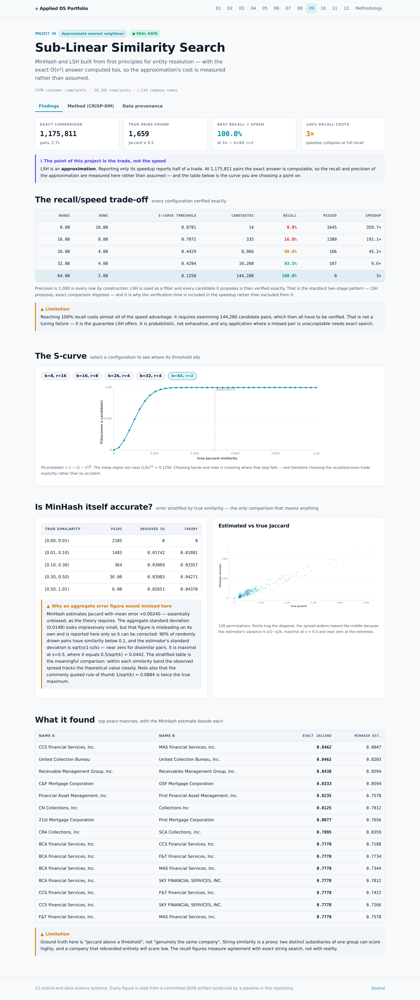

# 09 · Sub-Linear Similarity Search

MinHash and locality-sensitive hashing implemented from first principles for entity
resolution over **1,534 real company names** drawn from
28,156 CFPB consumer complaints — with the exact O(n²) answer computed as well,
so the cost of the approximation is **measured rather than assumed**.

| Dataset | Kind | Size | Origin | Licence |
|---|:---:|---|---|---|
| [US Consumer Financial Complaints](https://raw.githubusercontent.com/plotly/datasets/master/26k-consumer-complaints.csv) | 🟢 **REAL** | 28,156 complaints naming 1,534 distinct companies | Complaints filed by US consumers with the Consumer Financial Protection Bureau against financial institutions. Each row is a real complaint with its product, issue, company and disposition. | US Government work — public domain. |

## The claim this project refuses to make

Every LSH write-up reports a speedup. Almost none report what the speedup cost, because doing
so requires computing the exact answer — the very thing LSH exists to avoid. At
1,534 names that exact answer is still reachable:
**1,175,811 pairs in 2.682s**, finding 1,659 pairs at
Jaccard ≥ 0.5. Every approximate configuration below is scored against it.

## The recall/speed trade-off, measured

| Bands | Rows | S-curve threshold | Candidates | Recall | Missed | Time | Speedup |
|---:|---:|---:|---:|---:|---:|---:|---:|
| 8 | 16 | 0.878 | 14 | **0.8%** | 1,645 | 0.007s | **359.7×** |
| 16 | 8 | 0.707 | 335 | **16.8%** | 1,380 | 0.014s | **191.1×** |
| 26 | 4 | 0.443 | 8,966 | **90.0%** | 166 | 0.059s | **45.2×** |
| 32 | 4 | 0.420 | 10,260 | **93.5%** | 107 | 0.280s | **9.6×** |
| 64 | 2 | 0.125 | 144,280 | **100.0%** | 0 | 0.900s | **3.0×** |

Precision is 1.000 in every row **by construction**: LSH is used as a filter and every
candidate it proposes is verified exactly afterwards. That is the standard two-stage pattern,
and it is why verification time is *included* in the speedup rather than excluded from it — an
omission that would have reported 8.0× instead
of 3.0× for the 64-band configuration.

**The headline is a trade, not a number.** Full recall costs almost all of the advantage:
144,280 candidate pairs have to be examined, leaving
3.0×. Accepting 90.0% recall —
166 missed pairs out of 1,659 — buys
45.2×. Which of those is correct depends entirely on
whether a missed duplicate is an inconvenience or a compliance failure, and that is a decision
no benchmark can make.

## Is MinHash itself accurate?

3,994 pairs were sampled and their MinHash estimates compared against
exact Jaccard.

| True similarity | Pairs | Mean true *s* | Observed sd | Theoretical sd | Mean error |
|---|---:|---:|---:|---:|---:|
| `[0.00, 0.01)` | 2,105 | 0.0000 | 0.0000 | 0.0000 | +0.00000 |
| `[0.01, 0.10)` | 1,483 | 0.0434 | 0.0174 | 0.0180 | +0.00513 |
| `[0.10, 0.30)` | 364 | 0.1747 | 0.0307 | 0.0336 | +0.00509 |
| `[0.30, 0.50)` | 36 | 0.3717 | 0.0398 | 0.0427 | +0.00223 |
| `[0.50, 1.01)` | 6 | 0.5747 | 0.0265 | 0.0437 | +0.00602 |

The aggregate standard deviation is 0.0149, and quoting that figure
alone would be misleading in two separate ways — which is why the table above is stratified.

1. **89.8% of random pairs have similarity below 0.1**, where
   the estimator's variance is nearly zero. An aggregate is therefore dominated by the easy
   cases.
2. The estimator's standard deviation is **√(s(1−s)/k)**, not a constant. It peaks at
   *s* = 0.5, where it equals **0.5/√k = 0.0442** for
   k = 128 permutations.

The commonly quoted rule of thumb 1/√k = 0.0884 is **twice the
true maximum**. An earlier draft of this project reported observed spread against that number,
which made the estimator appear to beat its own theoretical variance — an impossible result,
and the tell that the theory line was wrong rather than the measurement.

Mean error across all sampled pairs is **+0.00240** — unbiased, as the theory
requires.

## Why the S-curve is the design surface

P(pair becomes a candidate) = 1 − (1 − sʳ)ᵇ, with a step near (1/b)^(1/r). Choosing bands and
rows *is* choosing where the step falls, and therefore choosing the recall/precision trade
explicitly rather than discovering it afterwards. The configurations above span thresholds
from 0.125 to
0.878, which is the whole reason their behaviour
differs so sharply.

## What it found

| Name A | Name B | Exact Jaccard | MinHash estimate |
|---|---|---:|---:|
| `CCS Financial Services, Inc.` | `MAS Financial Services, Inc.` | 0.846 | 0.805 |
| `United Collection Bureau` | `United Collection Bureau, Inc.` | 0.846 | 0.820 |
| `Receivable Management Group, Inc.` | `Receivables Management Group, Inc.` | 0.844 | 0.859 |
| `C&F Mortgage Corporation` | `GSF Mortgage Corporation` | 0.833 | 0.859 |
| `Financial Asset Management, Inc.` | `First Financial Asset Management, Inc.` | 0.824 | 0.758 |
| `CN Collections, Inc.` | `Collections Inc` | 0.812 | 0.781 |
| `21st Mortgage Corporation` | `First Mortgage Corporation` | 0.808 | 0.766 |
| `CRA Collections, Inc` | `SCA Collections, Inc.` | 0.789 | 0.836 |
| `BCA Financial Services, Inc.` | `CCS Financial Services, Inc.` | 0.778 | 0.719 |
| `BCA Financial Services, Inc.` | `F&T Financial Services, Inc.` | 0.778 | 0.773 |

Shingle size 3, mean 21.91 shingles per name.
Lowercased, punctuation replaced by spaces, whitespace collapsed. Corporate suffixes (LLC, Inc, Corporation) are deliberately NOT stripped: removing them would make matching artificially easy and obscure the question of whether the approximation finds what exact search finds.

## Screens




## CRISP-DM record

> **Business question.** The same company appears under many spellings in free-text complaint records. Can near-duplicate names be found without comparing every pair — and what exactly does the faster method miss?

### Business Understanding

Counting complaints per institution requires knowing which name strings refer to the same institution. Exact pairwise comparison is O(n²), which is fine at 1,534 names and impossible at a million. The question is what the sub-linear alternative costs in accuracy, which can only be answered by computing the exact answer as well and comparing.

**What makes this project's result trustworthy?**

- **Chose:** Computing the exact O(n²) answer and measuring the approximation against it.
- **Why:** LSH is an approximation. A write-up reporting only its speed is reporting half the trade. At this scale the exact answer is computable — 1.18M pairs — so the recall and precision of the approximation are measurable rather than assumed.
- *Rejected:* Report the speedup alone — the usual presentation, and it omits the cost being paid for it.
- *Rejected:* Use a library implementation — hides the banding mechanism, which is the part that determines the trade-off.

### Data Understanding

28,156 real complaints naming 1,534 distinct company strings. Exhaustive comparison requires 1,175,811 pairs, which is tractable here and is used as ground truth for everything below.

**Limitations**

- Ground truth is 'Jaccard above a threshold', not 'genuinely the same company'. String similarity is a proxy: two distinct subsidiaries of one group can score highly, and a company that rebranded entirely will score low. The recall figures measure agreement with exact string search, not with reality.

### Data Preparation

Names normalised and hashed into character 3-gram sets, averaging 21.9 shingles each.

**Character shingles or word tokens?**

- **Chose:** Character 3-grams.
- **Why:** The variation here is largely orthographic — spacing, abbreviation, typos. Word tokenisation treats a single misspelling as an entirely different token and the similarity collapses. Character n-grams degrade gracefully, losing only the few grams spanning the error.
- *Rejected:* Word tokens — brittle to typos, which are the dominant source of variation in free-text entry.
- *Rejected:* Stripping corporate suffixes — would inflate every similarity and make the comparison against exact search less informative.

### Modeling

128-permutation MinHash signatures built in 0.07s, then 5 LSH band configurations swept, each verified exactly and scored against the brute-force ground truth.

**How are bands and rows chosen?**

- **Chose:** Swept, and the whole trade-off curve published.
- **Why:** bands × rows fixes the S-curve threshold at approximately (1/b)^(1/r). There is no universally correct point on it — more bands means higher recall and more candidates to verify. Publishing the sweep lets a reader pick the point their own recall requirement implies.
- *Rejected:* Pick one configuration and report its numbers — presents a chosen point on a trade-off as though it were the method's performance.

**Are LSH candidates used directly?**

- **Chose:** No — every candidate is verified exactly.
- **Why:** LSH is a filter, not an answer. Its output contains false positives by construction. The standard two-stage pattern — LSH proposes, exact comparison disposes — keeps precision at 1.0 against the threshold while retaining the speedup, because verification runs over candidates rather than over all pairs.

### Evaluation

Best configuration by F1 is b=64, r=2: recall 100.0% at 3× the speed of exact search, examining only 12.2707% of all pairs. Highest recall achieved is 100.0% (b=64, r=2).

**Limitations**

- No configuration reaches 100% recall. The best here misses 0 of 1659 true pairs. That is not a defect to be tuned away — it is the guarantee LSH offers: probabilistic, not exhaustive. Any application where a missed pair is unacceptable needs exact search or a different method.
- Speedup is measured at n=1,534, where exact search is already fast. The asymptotic argument is what matters: exact search grows as O(n²) while LSH grows roughly linearly, so the advantage widens with scale and these figures understate it.
- Both stages run in one process on one core. A distributed implementation would change the constants substantially.

### Deployment

Signatures, the band sweep, the S-curves and the top exact matches are exported so the published page can let a reader move the threshold and watch recall and candidate volume trade against each other.


## Run it

```bash
git clone https://github.com/Pranjal101Shrivastava/Projects
cd Projects
pip install -r requirements.txt
export PYTHONPATH=lib

python3 projects/09_similarity_search/pipeline/build.py   # rebuilds every artifact below
python3 tools/audit.py                          # static leakage audit
```

Datasets download on first run into `.data/` and are verified against their recorded
SHA-256 on every run thereafter. The pipeline is seeded, so a rerun at the same commit
reproduces the same numbers.

---

**Live:** [https://pranjal101shrivastava.github.io/Projects/#/p/similarity-search](https://pranjal101shrivastava.github.io/Projects/#/p/similarity-search) *(requires GitHub Pages enabled)* ·
**Method:** [`pipeline/build.py`](./pipeline/build.py) ·
**Audit:** [`audit.md`](./audit.md) ·
**Artifacts:** [`artifacts/`](./artifacts/)

*Generated at commit `200f444` · seed 42 · 4.4s · Python 3.11.15 · numpy 2.4.6 · pandas 3.0.5 · sklearn 1.9.1 · lightgbm 4.7.0 · torch 2.14.0+cu130*
