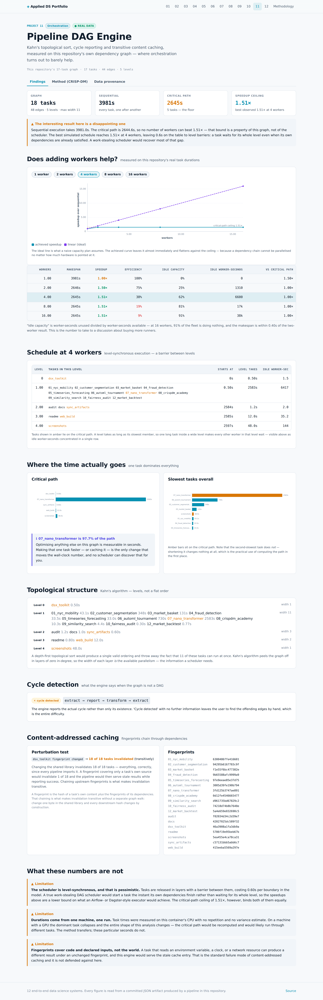

# 11 · Pipeline DAG Engine

A dependency-graph executor — Kahn's topological sort, cycle reporting, level scheduling and
transitive content-addressed caching — written from scratch and measured on **this
repository's own 18-task build graph**, where the honest conclusion is that
orchestration barely helps.

> **Data provenance.** This project consumes no external dataset. Its input is this repository's own dependency graph and the runtimes recorded in each pipeline's committed artifacts.

## The graph

18 tasks, 48 edges, 5 topological levels, maximum width
11. Executed one after another it takes
**3981.0s**.

| Level | Width | Tasks |
|---:|---:|---|
| 0 | 1 | `dsx_toolkit` |
| 1 | 11 | `01_nyc_mobility`, `02_customer_segmentation`, `03_market_basket`, `04_fraud_detection`, `05_timeseries_forecasting`, `06_automl_tournament`, `07_nano_transformer`, `08_crispdm_academy`, `09_similarity_search`, `10_fairness_audit`, `12_market_backtest` |
| 2 | 3 | `audit`, `docs`, `sync_artifacts` |
| 3 | 2 | `readme`, `web_build` |
| 4 | 1 | `screenshots` |

A depth-first topological sort would emit one valid ordering and discard the fact that
11 of these tasks can run simultaneously. Kahn's algorithm peels the graph off in
layers of zero in-degree, so the **width of each layer is the available parallelism** — which
is the information a scheduler actually needs.

## Does adding workers help? Mostly no.

| Workers | Makespan | Speedup | Efficiency | Idle capacity | Idle worker-sec | vs critical path |
|---:|---:|---:|---:|---:|---:|---:|
| 1 | 3981.0s | **1.00×** | 100% | 0% | 0 | 1.505× |
| 2 | 2645.6s | **1.50×** | 75% | 25% | 1,310 | 1.000× |
| 4 | 2645.2s | **1.51×** | 38% | 62% | 6,600 | 1.000× |
| 8 | 2645.2s | **1.51×** | 19% | 81% | 17,180 | 1.000× |
| 16 | 2645.2s | **1.51×** | 9% | 91% | 38,342 | 1.000× |

**1.51× is the ceiling**, and no worker count beats it. The best
observed result is 1.51× at 4 workers;
returns diminish from 4 workers onward. At 16
workers, 91% of the fleet is idle and the makespan is
within 0.0s of the
4-worker result.

This is the number to take to a discussion about buying more CI runners.

## Why: one task is the whole critical path

| # | Task | Seconds | Share of path |
|---:|---|---:|---:|
| 1 | `dsx_toolkit` | 0.5s | 0.0% |
| 2 | `07_nano_transformer` | 2583.5s | 97.7% |
| 3 | `sync_artifacts` | 0.6s | 0.0% |
| 4 | `web_build` | 12.0s | 0.5% |
| 5 | `screenshots` | 48.0s | 1.8% |

Critical path total: **2644.6s** of a 3981.0s sequential
run. `07_nano_transformer` alone accounts for
**97.7%** of it.

The slowest tasks overall:

| Task | Seconds | On critical path |
|---|---:|:---:|
| `07_nano_transformer` | 2583.5s | yes |
| `06_automl_tournament` | 729.9s | no |
| `02_customer_segmentation` | 347.5s | no |
| `03_market_basket` | 130.6s | no |
| `screenshots` | 48.0s | yes |
| `01_nyc_mobility` | 43.1s | no |

Note that not every slow task is on the path — shortening one that is not changes nothing at
all. That distinction is the practical reason to compute the path rather than to profile task
durations and start optimising the biggest number.

## Cycle detection that names the cycle

    extract → report → transform → extract

The engine reports the actual cycle rather than only its existence. 'Cycle detected' with no further information leaves the user to find the offending edges by hand, which is the entire difficulty.

## Content-addressed caching

A task's fingerprint is the hash of its own content **plus the fingerprints of its
dependencies**. That chaining is what makes invalidation transitive without a separate graph
walk: change one byte in the shared library and every downstream hash changes by construction.

Perturbation test: `dsx_toolkit fingerprint changed` →
**18 of 18 tasks invalidated**.

Changing the shared library invalidates 18 of 18 tasks — everything, correctly, since every pipeline imports it. A fingerprint covering only a task's own source would invalidate 1 of 18 and the pipeline would then serve stale results while reporting success. Chaining upstream fingerprints is what makes invalidation transitive.

| Task | Fingerprint |
|---|---|
| `01_nyc_mobility` | `6300486ffe416601` |
| `02_customer_segmentation` | `94295b6167783c9f` |
| `03_market_basket` | `f1e55f6bc477382e` |
| `04_fraud_detection` | `9b65588afc9999a9` |
| `05_timeseries_forecasting` | `97e9eeae85e37d75` |
| `06_automl_tournament` | `3005d39fe190b794` |
| `07_nano_transformer` | `3fd125b3747ae891` |
| `08_crispdm_academy` | `0d12fe4546665477` |
| `09_similarity_search` | `d961735bd67829c2` |
| `10_fairness_audit` | `74218d74b8b7640e` |
| `12_market_backtest` | `5a4e659e032690c5` |
| `audit` | `f02034d34c2d39e7` |
| `docs` | `42027025dc589f32` |
| `dsx_toolkit` | `46a3908a1fa3db9a` |
| `readme` | `5786f19e95beb67b` |
| `screenshots` | `5ea455e4ca78ca31` |
| `sync_artifacts` | `c57131bbb5abb6c7` |
| `web_build` | `415eeba5569a297e` |

## Screens




## CRISP-DM record

> **Business question.** Twelve pipelines with shared dependencies are run by hand. What does proper orchestration — ordering, caching, parallelism — actually save, measured on the real graph rather than assumed?

### Business Understanding

Running pipelines by hand fails in three specific ways as a project grows: wrong order produces stale results silently, re-running unchanged work wastes time, and independent work runs sequentially for no reason. An orchestrator addresses all three, but how much it is worth depends entirely on the shape of the dependency graph — which is measurable.

**How is the value of orchestration established?**

- **Chose:** Measured on this repository's real graph and real runtimes.
- **Why:** Speedup from parallelism is bounded by the critical path, which is a property of the specific graph. Quoting a general figure would be meaningless. Durations come from each pipeline's committed _run block, so the analysis describes this portfolio.
- *Rejected:* Benchmark on a synthetic DAG — the result would describe the synthetic graph and nothing else.
- *Rejected:* State that parallelism helps — true and useless without the bound.

### Data Understanding

The graph has 18 tasks and 48 edges across 5 dependency levels, with a maximum width of 11. Durations are the real recorded runtimes from each pipeline's committed _run block.

**Limitations**

- Durations were measured on a 4-core container under varying load, so they carry real noise. The scheduling conclusions depend on their relative sizes, which are stable, rather than on absolute values.
- The simulation assumes workers are independent. In practice the pipelines contend for CPU and memory, so real parallel speedup will fall short of these figures.

### Data Preparation

Tasks are discovered by scanning for pipeline entry points; edges come from declared dependencies. Downstream tooling is declared to depend on every pipeline, which is genuinely true — the audit, artifact sync and documentation generator all read every project's output.

### Modeling

Kahn's algorithm for level-parallel topological ordering, tri-colour DFS for cycle reporting, chained content fingerprints for transitive cache invalidation, and LPT packing within each level.

**Kahn's algorithm or depth-first topological sort?**

- **Chose:** Kahn's.
- **Why:** DFS produces a valid linear order but discards the information that two tasks were independent. Kahn's processes by in-degree, so each batch of available tasks falls out as a parallel level. The scheduling question needs that structure, not just a valid sequence.
- *Rejected:* DFS post-order — correct ordering, no parallelism information.

**What goes into a task's cache fingerprint?**

- **Chose:** Its own inputs AND the fingerprints of its dependencies.
- **Why:** Changing the shared library invalidates 18 of 18 tasks — everything, correctly, since every pipeline imports it. A fingerprint covering only a task's own source would invalidate 1 of 18 and the pipeline would then serve stale results while reporting success. Chaining upstream fingerprints is what makes invalidation transitive.
- *Rejected:* Hash only the task's own source and inputs — a change deep in the graph then invalidates nothing downstream, and the pipeline serves stale results while reporting success.
- *Rejected:* Timestamp comparison — breaks on checkout, clock skew and any file touched without being changed.

### Evaluation

Sequential execution takes 3981.0s. The critical path is 2644.6s, so no number of workers can beat 1.51× — that bound is a property of this graph, not of the scheduler. The best simulated schedule reaches 1.51× at 4 workers, leaving 0.6s on the table to level barriers: a task waits for its whole level even when its own dependencies are already satisfied. A work-stealing scheduler would recover most of that gap.

**Limitations**

- Speedup is bounded at 1.51× by the critical path, and screenshots alone accounts for 48s of it. Adding workers past 4 changes nothing; optimising that one task is the only thing that would.
- Level barriers cost 0.6s in the best schedule. This is a known limitation of level-parallel scheduling and is reported rather than described as optimal.
- All figures are simulated from measured durations, not from an actual parallel run. Real execution adds process startup, I/O contention and memory pressure.

### Deployment

The graph, levels, critical path and schedule sweep are exported so the published page can render the DAG and let a reader move the worker count and watch the makespan flatten against the critical path.


## Run it

```bash
git clone https://github.com/Pranjal101Shrivastava/Projects
cd Projects
pip install -r requirements.txt
export PYTHONPATH=lib

python3 projects/11_pipeline_dag/pipeline/build.py   # rebuilds every artifact below
python3 tools/audit.py                          # static leakage audit
```

Datasets download on first run into `.data/` and are verified against their recorded
SHA-256 on every run thereafter. The pipeline is seeded, so a rerun at the same commit
reproduces the same numbers.

---

**Live:** [https://pranjal101shrivastava.github.io/Projects/#/p/dag-engine](https://pranjal101shrivastava.github.io/Projects/#/p/dag-engine) *(requires GitHub Pages enabled)* ·
**Method:** [`pipeline/build.py`](./pipeline/build.py) ·
**Audit:** [`audit.md`](./audit.md) ·
**Artifacts:** [`artifacts/`](./artifacts/)

*Generated at commit `dff3e52` · seed 42 · 0.08s · Python 3.11.15 · numpy 2.4.6 · pandas 3.0.5 · sklearn 1.9.1 · lightgbm 4.7.0 · torch 2.14.0+cu130*
